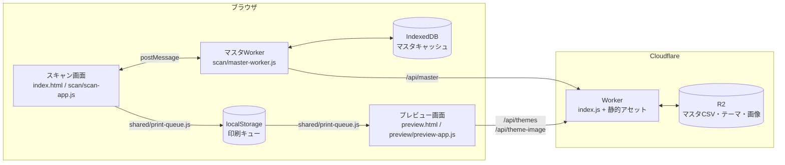
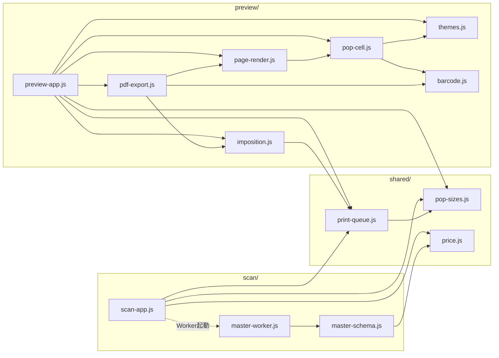

# POP作成システム 技術ドキュメント

Sep 27, 2026 · @tana（第3版：修正フォーム・バーコード・余白4mm・フォルダ構成の整理を反映

## 概要

店頭の値札POPを、JANコードのスキャンから A4 面付けPDFまで一気に作るWebアプリです。商品マスタ（CSV）と POP デザイン（テーマ）は Cloudflare R2 に置き、Cloudflare Worker が API として配信します。画面の HTML・JS・CSS も同じ Worker から静的アセットとして配信しています。

作業の流れは3段階です。

1. スキャン画面（index.html）で JAN をスキャン、または商品名で検索して印刷待機リストに追加する。マスタの内容に誤りがあれば、リスト上のフォームで修正し、規格ごとの枚数を指定する
2. プレビュー画面（preview.html）で面付けモードとデザインを選び、A4 ページの仕上がりを確認する
3. 「A4-PDFファイルを直接ダウンロード」でブラウザ内で PDF を生成して保存する

対応する POP 規格は A9タテ・A8ヨコ・A6ハーフ・A6ヨコ・A5ヨコ・A4ヨコ の6種類です。すべての POP の下部に JAN のバーコードと数字を印字します。PDF はすべてブラウザ側で生成するため、サーバー側に印刷処理はありません。

## システム構成

ブラウザ側で動く2画面とマスタWorker（Web Worker）、Cloudflare 側の Worker と R2 の組み合わせです。2画面の間はサーバーを経由せず、localStorage で印刷リストを受け渡します。



スキャン画面は重い処理（マスタのダウンロード・解析・検索）をすべてマスタWorkerに任せ、postMessage で結果だけを受け取ります。**列名の解決もマスタWorkerの中で完結し、画面には変換済みの「商品データ」だけが渡されます**（形は「データ仕様」を参照）。そのため画面側のコードは CSV の列名を一切扱いません。プレビュー画面はマスタを使わず、印刷キュー（修正済みの商品データを含む）と /api/themes のデザインだけで POP を描画します。

## ファイル一覧と役割

ブラウザ側の JS はすべて ES モジュールで、画面ごとのフォルダと両画面共通の `shared/` に分かれています。HTML から直接読み込むのは各画面の入口1本だけで、残りは `import` で読み込まれます。

| 配置 | ファイル | 役割 |
| --- | --- | --- |
| / | index.html | スキャン画面。JAN入力欄・商品名検索・印刷待機リスト |
| / | preview.html | A4面付けプレビュー・PDF出力画面 |
| /css/ | app.css | 両画面の画面部品（ヘッダー・入力欄・リスト・修正フォーム・ボタン等） |
| /css/ | pop-styles.css | POPセルとA4用紙のスタイル、共通余白、サイズ別の文字・バーコード寸法 |
| /js/shared/ | pop-sizes.js | POP規格（6サイズ）・混載グリッド・既定サイズ・初期枚数 |
| /js/shared/ | price.js | 税率・税抜価格の計算 |
| /js/shared/ | print-queue.js | 印刷キューの保存・読込・枚数集計。localStorage に触るのはこのファイルだけ |
| /js/scan/ | scan-app.js | スキャン画面の入口。画面操作・印刷リスト・修正フォーム・マスタWorkerとの通信 |
| /js/scan/ | master-worker.js | マスタの取得・IndexedDBキャッシュ・JAN索引・商品名検索（モジュールWorker） |
| /js/scan/ | master-schema.js | マスタの列名定義と「CSVの1行 → 商品データ」の変換。マスタWorker専用 |
| /js/preview/ | preview-app.js | プレビュー画面の入口。キュー読込・テーマ選択・描画・PDFボタン |
| /js/preview/ | themes.js | テーマ一覧の取得・画像URLの決定・配色の適用 |
| /js/preview/ | imposition.js | 面付け計算（DOM非依存）。A4用紙寸法 `PAGE_MM` もここで定義 |
| /js/preview/ | page-render.js | A4ページのDOM生成・A5回転配置・空状態の案内。回転配置の目印クラスもここで定義 |
| /js/preview/ | pop-cell.js | POP 1枚分のDOM生成・税抜価格の自動縮小 |
| /js/preview/ | barcode.js | JANバーコード（EAN-13/EAN-8）の符号化と要素生成。目印クラスもここで定義 |
| /js/preview/ | pdf-export.js | html2canvas + jsPDF によるPDF出力、バーコードのベクター描画 |
| Worker | index.js | /api/master・/api/themes・/api/theme-image の配信 |

wrangler-account.json（Cloudflare アカウント情報）と cf.json（アクセス元の接続情報）はプログラム本体ではないため、この文書では扱いません。

## 機能説明: スキャン画面

マスタが使える状態になるまで入力欄は無効で、使えるようになった時点（キャッシュ読込でも可）で JAN 入力欄へ自動でフォーカスします。

### JANコード連続スキャン

- Enter で確定すると入力欄を即座にクリアし、次のスキャンを受け付ける
- マスタWorker に `lookup` を依頼し、見つかればリスト先頭に追加、見つからなければ赤色の通知を4秒表示
- 同じ JAN を再スキャンすると新規行は作らず、既定サイズ（A9タテ）の枚数を +1 してその行を先頭へ移動する。修正フォームで直した内容はそのまま残る
- 新規追加時の初期枚数は既定サイズ 1枚、他のサイズは 0枚（既定サイズは shared/pop-sizes.js の `DEFAULT_SIZE_KEY`）

### 商品名あいまい検索

- 入力から 150ms 待ってから マスタWorker に `search` を依頼（入力のたびに検索しない）
- 最大20件の候補を表示し、クリックでリストに追加。追加後は JAN 入力欄にフォーカスを戻す
- 連番で古い検索結果を破棄するため、速く打っても表示が逆戻りしない

### 印刷待機リスト

- 1商品につき1枚のカードで、上段に JAN・操作ボタン、中段に修正フォームと主要サイズの枚数欄、下段にオプションサイズの枚数欄を表示する
- 枚数欄は shared/pop-sizes.js の定義から自動生成する。`primary: true` のサイズ（A9タテ・A8ヨコ・A6ハーフ）は常時表示、それ以外（A6ヨコ・A5ヨコ・A4ヨコ）は「⚙️ 他サイズ」で開閉
- 既定サイズ（A9タテ）の枚数欄は強調表示
- 「全行のオプションサイズ表示切替」で全行を一括開閉
- 🗑️ で1行削除、「リストを全クリア」で確認のうえ全削除
- リストは変更のたびに localStorage（`pop_print_queue_v2`）へ保存され、ブラウザバックや再読み込みでも復元される
- 「印刷プレビュー・PDF出力画面へ進む」でリストを保存して preview.html へ移動

### 商品情報の修正フォーム

マスタの内容が正しくない場合に、印刷する POP の内容だけを画面上で直せます。

- 修正できる項目: 商品名・メーカー・コメント・数量1・数量2・医薬品区分・税込価格・税抜価格（POP に載る項目すべて）
- JAN は修正不可（同一商品の判定と「マスタの値に戻す」に使うため）
- 修正は入力欄から離れたとき（または Enter）に確定し、印刷キューに保存される。プレビュー・PDF にはこの内容が使われる
- 修正欄や枚数欄で Enter を押すと、確定してから JAN 入力欄にフォーカスが戻る（修正後そのまま次のバーコードを読んでも、修正欄に JAN が入らない）
- 税抜価格: マスタで空だった商品は空欄で「自動: 1,000」のように表示され、税込価格を直すと自動で計算し直される。数字を入れるとその値が優先され、空欄に戻すと自動計算に戻る
- 修正したカードは黄色になり「✏️ 修正済み」と「↺ マスタの値に戻す」が表示される。戻すボタンはマスタから同じ JAN の商品を取り直す
- 修正はこのリストの中だけで有効で、商品マスタ（R2 の CSV）は変更しない。行を削除・全クリアすると修正内容も消える

### マスタ状態の表示

ヘッダー右上のバッジにマスタWorkerの状態を表示します。Worker の状態と表示は1対1です。

| 状態 | 表示例 | 意味 | 入力 |
| --- | --- | --- | --- |
| （起動前） | ⏳ マスタ読み込み中... | HTMLの初期表示。scan-app.js がまだ動いていない | 無効 |
| loading | ⏳ マスタをダウンロード中... / 解析中... | キャッシュが無く初回取得中 | 無効 |
| checking | マスタ読込: n件（最新を確認中…） | キャッシュで利用開始、裏で最新確認中 | 有効 |
| synced | マスタ同期完了: n件 | 最新のマスタで利用中（304 または初回取得完了） | 有効 |
| updated | マスタ更新済み: n件 | キャッシュが古かったので最新に差し替えた | 有効 |
| offline | ⚠️ サーバー接続不可・保存済みマスタ使用中: n件 | オフライン等でキャッシュを継続使用 | 有効 |
| error | ⚠️ マスタ読み込み失敗 | キャッシュも無く取得にも失敗 | 無効 |

「⏳ マスタ読み込み中...」のまま変わらない場合は、画面側のスクリプトが動いていません（「運用・保守メモ」のトラブルシューティングを参照）。

## 機能説明: 商品マスタWorker

マスタは「まず手元のキャッシュで即利用、裏でサーバーに最新確認」の方式で読み込みます。画面スレッドは一切マスタを持たないため、約10万件でも画面が固まりません。

モジュールWorkerとして、scan-app.js から `new Worker(new URL('./master-worker.js', import.meta.url), { type: 'module' })` で起動します。パスは scan-app.js からの相対指定なので、配置ディレクトリに依存しません。

### 初期化の流れ（`init` 受信時に1回だけ）

1. IndexedDB（DB名 `pop-master-cache`、ストア `master`、キー `current`）からキャッシュを読む
2. キャッシュがあれば索引を作って即 `checking` を通知。無ければ `loading` を通知
3. `/api/master` を `cache: 'no-store'` で取得。キャッシュがあればそのバージョンを `If-None-Match` に付ける
4. 304 なら `synced` を通知して終了
5. 200 なら JSON の形式を確認し、必須列（jan・name・price）が見出しに無ければコンソールに警告
6. 索引を作り直して `synced`（初回）または `updated`（差し替え）を通知し、IndexedDB に保存（保存失敗は警告のみ）
7. 通信やサーバーエラー時は、キャッシュがあれば `offline`、無ければ `error` を通知

IndexedDB にはサーバー応答（`{ version, headers, rows }`）をそのまま保存します。商品データへの変換は検索結果を返すときに行うため、10万件ぶんのオブジェクトを作り置きすることはありません。

### 索引と検索

- 索引作成時に、見出し行から各項目（jan・name など）の列番号を1回だけ求め、以後は行ごとに列番号で値を読む（`createRowReader`）
- JAN索引: 正規化した JAN（全角→半角、空白・ハイフン除去）→ 行番号の Map。`lookup` は完全一致で1件を返す
- 商品名索引: NFKC 正規化 + 小文字化した商品名の配列。`search` は部分一致で先頭から最大 limit 件（既定20）を返す
- 返却時に該当行を商品データに変換する（税抜価格の補完もここで行う。計算式は shared/price.js）
- 新しい索引は作り終えてからまとめて差し替えるため、差し替え中の検索が中途半端な状態を見ることはない
- `lookup` と `search` は初回の索引作成が終わるまで待ってから処理する

### メッセージ仕様

| 方向 | type | 内容 |
| --- | --- | --- |
| 画面 → Worker | init | 初期化開始 |
| 画面 → Worker | lookup | `{ id, jan }` |
| 画面 → Worker | search | `{ id, keyword, limit }` |
| Worker → 画面 | status | `{ state, count, message? }`。state は上の表の6種類 |
| Worker → 画面 | result | `{ id, data }`。data は商品データ（lookup）または商品データの配列（search）。見つからなければ null / 空配列 |

## 機能説明: プレビュー・面付け・PDF出力

プレビュー画面は「印刷キュー読込 → テーマ取得 → 面付け計算 → DOM描画 → 税抜価格の自動縮小」の順で動き、モードかデザインを変えるたびに面付けからやり直します。

- 印刷対象が0枚のときは、案内と「スキャン画面に戻る」ボタンを表示し、操作欄を無効にする
- テーマ一覧の取得に失敗したときは、状態欄に警告を出し、「標準」（テーマ指定なしの既定配色）で表示を続ける
- 状態欄には「商品 n件 ／ POP 合計 n枚 ／ A4 nページ」を表示する

### 面付けモード（imposition.js）

- **規格ごとに用紙を分ける**（separated）: サイズごとに POP を並べ、`cols × rows` 枚ずつ A4 に詰める。A5ヨコだけ A4タテ用紙、他は A4ヨコ用紙。サイズの順は shared/pop-sizes.js の定義順
- **1枚のA4に混載**（mixed）: A4ヨコを 8列×4行（1マス 37.125mm × 52.5mm）のグリッドとみなし、大きい規格から順に「左上から空いている場所」へ詰める（First Fit）。入らなければ新しいページを追加。A5ヨコは 4×4 マスの縦長枠に -90° 回転して配置

面付け結果は DOM に依存しない「ページ記述」（向き・列数・行数・マス寸法・配置リスト）として返すため、単体でテストできます。A4 用紙上のマス割りはミシン目に合わせてあり、余白を含めて変更しません（余白は各 POP の内側で取ります）。

### POPの描画（pop-cell.js / page-render.js / themes.js）

- 1枚の POP は上から コメント・メーカー名・商品名（最大2行）・数量1/数量2・税抜価格（黒丸「税抜」バッジ付き）・区切り線・税込価格・医薬品リスク区分・JANバーコードと数字 の順
- 印刷キューの商品データ（修正済みの内容を含む）をそのまま使う
- **余白**: すべてのサイズで上下左右に最低 4mm（`--pop-safe-margin`）を確保する。プリンターの印刷できない範囲（用紙の端から約4mm）に文字や価格が掛からないようにするため。サイズ別の余白がこれより大きい場合（A6ヨコ・A5ヨコ・A4ヨコ）はそちらを使う
- **位置のそろえ**: 医薬品区分やバーコードが無い POP でもその行の高さを確保するため、同じ用紙に並んだ POP の税抜価格の位置がそろう
- **税抜価格の自動縮小**: 価格が「税抜」バッジと並んで1行に入り切らない場合（桁の多い価格など）は、その POP の価格の文字だけを自動で縮める（最小で元の50%）。描画後に `fitPopText` が行う
- 画像は A9タテだけ上部、それ以外は左側。A9タテは専用画像（例: `sale.png` → `sale_a9.png`）を優先し、無ければ通常画像、それも無ければ画像エリアを消す
- テーマの `bgColor`・`commentColor`・`priceColor` を CSS 変数として POP ごとに上書き
- マス寸法は `1fr` ではなく mm で固定し、中身によるズレを防ぐ

### JANバーコード（barcode.js）

外部ライブラリは使わず、自前で符号化しています。

| JAN の桁数 | 扱い |
| --- | --- |
| 13桁 | チェックデジットが正しければ EAN-13 |
| 12桁 | UPC-A として正しければ先頭に 0 を付けて EAN-13 |
| 8桁 | チェックデジットが正しければ EAN-8 |
| それ以外・チェックデジット誤り | バーコードにせず数字だけを表示（読めないバーコードを印刷しないため）。高さはバーコードありと同じ |

- 画面上は SVG で表示し、線1本ごとの情報（`data-bits`）を持たせる
- 線の太さは JAN 規格の最小倍率 0.8 倍以上（A9 約0.83倍 〜 A4 約1.6倍）。高さは規格より低い短縮寸法（A9で5mm）
- 左右の白い余白（クワイエットゾーン: EAN-13 は左11・右7モジュール、EAN-8 は左右7モジュール）を含めた全体が欄に入り切らない場合は、線が切れないように全体を縮めて収める
- A9 は欄が狭いため、クワイエットゾーンだけが POP の余白側へ最大 1.5mm 入ってよい（`--pop-barcode-bleed`）。黒い線は 4mm の内側に収まる

### PDF出力（pdf-export.js）

1. Webフォントの読み込み完了を待つ
2. ページごとに html2canvas で撮影（倍率2、JPEG品質0.98）し、jsPDF で A4 に貼る。このときバーコードの線は撮影から除外する
3. 回転配置の POP は、ページ撮影時は除外し、回転前の状態で別撮影 → canvas で -90° 回転 → 所定の位置に貼り重ねる（html2canvas が transform と overflow:hidden の組み合わせを正しく描けないための回避策）
4. 最後にバーコードの線を jsPDF の長方形としてベクターで描く。画面上の配置から位置（mm）を求め、回転配置の中のものは向きを変えて描く。JPEG 化によるにじみでスキャナーが読めなくなるのを防ぐため
5. `POP_Print_YYYY-MM-DD.pdf` として保存。日付は端末の現地時刻（日本時間）

作成中はボタンが「⏳ PDFを作成中...」になり、二重押しできません。失敗した場合は理由をダイアログで表示します。

## サーバーAPI仕様（index.js）

Cloudflare Worker は GET の3つの API だけを持ち、それ以外のパスには 404 を返します（HTML・JS・CSS は Workers の静的アセット機能が先に応答します）。

| エンドポイント | R2 のキー | 応答 | キャッシュ |
| --- | --- | --- | --- |
| /api/master | `masters/item_master.csv`（`MASTER_R2_KEY` で変更可） | `{ version, headers, rows }` の JSON | ETag + `no-cache`、一致すれば 304 |
| /api/themes | `themes/manifest.json` | マニフェストをそのまま JSON で返す | `no-cache` |
| /api/theme-image/:filename | `images/<filename>` | 画像本体（R2 のメタデータ付き） | `public, max-age=86400`（1日） |

### /api/master の処理

1. R2 の `head` で CSV の etag だけを取得（本文は読まない）
2. ETag を `"v2-<R2のetag>"` の形で作る。`If-None-Match` と一致すれば 304（Cloudflare が付ける `W/` は無視して比較）
3. エッジキャッシュ（Cache API）に変換済み JSON があれば返す（`X-Master-Cache: HIT`）
4. 無ければ CSV を読み、文字コード変換 → CSV 解析 → JSON 化して返す（`X-Master-Cache: MISS`）。手順1と4の間に CSV が更新された場合は、実際に読んだ版のバージョンを使い、キャッシュには保存しない

文字コードは既定で Shift\_JIS、先頭に UTF-8 の BOM があれば自動で UTF-8 として読みます。CSV パーサーはダブルクォート、カンマや改行を含む値、改行コードの混在に対応し、列数が足りない行は空文字で埋めます。

キャッシュは3層で、それぞれ守る対象が違います。IndexedDB＋ETag/304 は各端末が約10万件を毎回ダウンロードしないため、エッジキャッシュは CSV の文字コード変換と解析を端末ごとにやり直さない（Worker の CPU 時間を抑える）ためのものです。

### /api/theme-image の安全対策

ファイル名に `/`・`\`・`..` が含まれる場合は 400 を返し、`images/` 以外の R2 オブジェクトを読めないようにしています。

## 依存関係

依存のルールは2つです。

- 読み込みの向きは「入口 → 各機能 → shared」の一方通行。shared は画面側のファイルを読まない
- スキャン画面（scan/）とプレビュー画面（preview/）は互いを読まず、shared を介してだけつながる

すべて `import` による明示的な依存で、循環はありません。HTML の script タグの読み込み順を気にする必要もありません。

### モジュール依存（矢印は import の向き）



定数は「それを決めるファイル」に置き、使う側が import します。A4 用紙寸法 `PAGE_MM` は imposition.js、回転配置の目印クラスは page-render.js、バーコードの目印クラスは barcode.js にあり、pdf-export.js はそれぞれから読み込みます。

pdf-export.js は、preview.html が同期読み込みする html2canvas・jsPDF をグローバル変数（`html2canvas`・`jspdf.jsPDF`）として使います。この2つだけは preview-app.js より前に script タグで読み込む必要があります。

### 外部ライブラリ・サービス

| 名前 | 版 | 読み込み元 | 使う場所 |
| --- | --- | --- | --- |
| html2canvas | 1.4.1 | cdnjs.cloudflare.com | PDF出力（ページ撮影） |
| jsPDF | 2.5.1 | cdnjs.cloudflare.com | PDF出力（A4生成・バーコードのベクター描画） |
| Cloudflare Workers | — | — | API実行環境・静的アセット配信。Cache API はカスタムドメインでのみ有効 |
| Cloudflare R2 | — | バインディング `MY_R2_BUCKET` | マスタCSV・テーマ・画像の保管 |

CSS フレームワークとバーコードライブラリは使っていません。ブラウザ機能としては ES モジュール・モジュールWorker・IndexedDB・localStorage・fetch・SVG を使います。

## データ仕様

### POP規格（shared/pop-sizes.js）

| キー | 表示名（label） | POP寸法 | 1ページの面数 | 用紙 | 画像位置 | 混載時のマス（幅×高さ） | 常時表示（primary） |
| --- | --- | --- | --- | --- | --- | --- | --- |
| a9 | A9タテ | 37.125 × 52.5 mm | 32（8×4） | A4ヨコ | 上 | 1 × 1 | ○（既定サイズ） |
| a8 | A8ヨコ | 74.25 × 52.5 mm | 16（4×4） | A4ヨコ | 左 | 2 × 1 | ○ |
| a6half | A6ハーフ | 148.5 × 52.5 mm | 8（2×4） | A4ヨコ | 左 | 4 × 1 | ○ |
| a6 | A6ヨコ | 148.5 × 105 mm | 4（2×2） | A4ヨコ | 左 | 4 × 2 | — |
| a5 | A5ヨコ | 210 × 148.5 mm | 2（1×2） | A4タテ | 左 | 4 × 4（90°回転） | — |
| a4 | A4ヨコ | 297 × 210 mm | 1 | A4ヨコ | 左 | 8 × 4 | — |

pop-sizes.js には他に、既定サイズ `DEFAULT_SIZE_KEY`（`a9`）と初期枚数を作る `createDefaultCounts()` があります。税率 `TAX_RATE`（1.1）と `calcPriceExcl()` は shared/price.js にあります。

### POPの見た目の設定（css/pop-styles.css）

| CSS変数 | 場所 | 内容 |
| --- | --- | --- |
| `--pop-safe-margin` | `:root` | 全サイズ共通の最低余白（上下左右、既定 4mm） |
| `--pop-pad-y` / `--pop-pad-x` | `.pop-size-*` | サイズ別の余白。共通余白より大きい場合だけ使われる（A6ヨコ・A5ヨコ・A4ヨコ） |
| `--pop-*-size` | `.pop-size-*` | 各項目の文字サイズ |
| `--pop-barcode-w` | `.pop-size-*` | バーコード本体（95モジュール）の幅 |
| `--pop-barcode-h` | `.pop-size-*` | バーコードの線の高さ |
| `--pop-barcode-text-size` | `.pop-size-*` | バーコード下の数字の文字サイズ |
| `--pop-barcode-bleed` | `.pop-size-a9` | クワイエットゾーンが余白側へ入ってよい幅 |

### 商品マスタの列（scan/master-schema.js）

候補の列名を左から順に探し、最初に値が入っていた列を使います。CSV の列名が変わったら候補を追加するだけで対応できます。

| キー | 候補の列名 | 使う場所 |
| --- | --- | --- |
| jan | JANコード / JAN / jan | 検索・索引・バーコード（必須） |
| name | 品名 / 商品名 | 検索・表示・POP（必須） |
| maker | 製造メーカー / メーカー | 表示・POP |
| price | 販売価格(税込) / 税込価格 | 表示・POP（必須） |
| priceExcl | 販売価格(税抜) / 税抜価格 | POP。空なら税込 ÷ 1.1 を四捨五入 |
| comment | コメント / アピール文 | POP |
| qty1 | 数量1 / 内容量 | POP |
| qty2 | 数量2 / 規格 | POP |
| risk | リスク分類 / 医薬品区分 | POP |

価格は「1,000」「¥1000」「１０００円」なども数値として読み、読めなければ 0 になります。

### 商品データ（マスタWorker → 画面、印刷キュー内）

マスタWorkerが CSV の1行から作る、画面側で扱う唯一の商品の形です。スキャン画面の修正フォームはこの値を書き換えます。

| 項目 | 型 | 内容 |
| --- | --- | --- |
| jan | 文字列 | 正規化済みの JAN |
| name / maker | 文字列 | 商品名・メーカー名 |
| price | 数値 | 税込価格 |
| priceExcl | 数値 | 税抜価格（列が空なら税込から計算済み） |
| priceExclAuto | 真偽値 | true = 税抜価格を税込から計算した（修正フォームで税込を直すと追従する） |
| comment / qty1 / qty2 / risk | 文字列 | コメント・数量1・数量2・医薬品リスク区分 |

### 印刷キュー（localStorage `pop_print_queue_v2`、shared/print-queue.js）

```json
[
  {
    "item": {
      "jan": "4901234567894", "name": "…", "maker": "…",
      "price": 298, "priceExcl": 271, "priceExclAuto": true,
      "comment": "", "qty1": "", "qty2": "", "risk": ""
    },
    "counts": { "a9": 1, "a8": 0, "a6half": 0, "a6": 0, "a5": 0, "a4": 0 },
    "showOptions": false,
    "edited": false
  }
]
```

`item` は上記の商品データ、`edited` は修正フォームで修正したかどうかです。値は例です。読み込み時は、形の壊れた行を除き、サイズ追加などで欠けた枚数欄を 0 で補います。旧版の `pop_print_queue`（`item` がマスタの列名そのままの形）は読み込みません。

### テーマ（R2 `themes/manifest.json`）

コードが読んでいる項目から見た形式です。配列で、先頭のテーマが初期選択になります。将来は Web の管理画面から作成できるようにする予定のため、R2 に置いています。

| 項目 | 内容 |
| --- | --- |
| id | テーマの識別子（選択肢の値） |
| name | 選択肢の表示名。無ければ id を表示 |
| image | 画像ファイル名（R2 の `images/` 配下）。省略すると画像なし |
| bgColor | POP の背景色 |
| commentColor | コメントの文字色 |
| priceColor | 税抜価格の文字色 |

## 運用・保守メモと注意点

### Worker の設定値

| 名前 | 種類 | 既定値 | 内容 |
| --- | --- | --- | --- |
| MY\_R2\_BUCKET | R2バインディング | なし（必須） | マスタ・テーマ・画像を置くバケット |
| MASTER\_R2\_KEY | 環境変数 | masters/item\_master.csv | マスタCSVの置き場所 |
| MASTER\_ENCODING | 環境変数 | shift-jis | CSVの文字コード（BOM付きUTF-8は自動判定） |

### よくある作業

- **マスタを更新する**: R2 の CSV を上書きするだけ。各端末は次に画面を開いたとき etag の変化を検知して自動で差し替える
- **CSV の列名が変わった**: scan/master-schema.js の `COLUMNS` に新しい列名を候補として追加する。Worker（index.js）や画面側の修正は不要
- **POP に表示する項目を増やす**: scan/master-schema.js の `COLUMNS` と `toItem` に項目を追加し、preview/pop-cell.js の描画と scan/scan-app.js の `EDIT_FIELDS`（修正フォーム）に加える
- **POP のサイズを追加する**: shared/pop-sizes.js に1件追加（`label`・`primary` を含む）し、css/pop-styles.css に `.pop-size-*`（文字サイズ・バーコード寸法）を追加する。スキャン画面の枚数欄は自動で増える
- **既定サイズを変える**: shared/pop-sizes.js の `DEFAULT_SIZE_KEY`
- **POP の余白を変える**: css/pop-styles.css の `--pop-safe-margin`（全サイズに反映）
- **バーコードが読みにくい**: css/pop-styles.css のサイズ別 `--pop-barcode-h`（高さ）・`--pop-barcode-w`（幅）を大きくする。幅は 25.1mm（0.8倍）未満にしない
- **税率を変える**: shared/price.js の `TAX_RATE`
- **API の応答形式や文字コード設定を変えた**: index.js の `MASTER_FORMAT`（現在 `v2`）を上げると、全端末のキャッシュが無効化される
- **印刷キューの形を変えた**: shared/print-queue.js の `QUEUE_STORAGE_KEY` の末尾の番号を上げる（古い形式のキューは読まれなくなる）
- **取得元を社内サーバー等に変える**: index.js に `getVersion()` と `getCsv()` を持つ部品を作り、`createMasterSource` で差し替える。画面側は変更不要

### デプロイ時の注意

- HTML と JS は必ずセットで差し替える。古い HTML は古い場所・古い形式で JS を読むため、何も動かなくなる
- ファイルを移動・改名した版を反映するときは、サーバー上の旧ファイルを削除する（2026-09-27 の構成整理で不要になったもの: `js/pop-config.js`・`js/master-schema.js`・`js/master-worker.js`・`js/scan-app.js`・`js/preview.js`・`js/preview/constants.js`・`js/preview/data.js`）
- 差し替え後は各端末で強制再読み込み（Ctrl+Shift+R、Mac は Cmd+Shift+R）を行い、古い HTML がキャッシュから使われていないことを確認する

### トラブルシューティング

**マスタの読み込みが終わらない**

| バッジの表示 | 状況 | 確認すること |
| --- | --- | --- |
| ⏳ マスタ読み込み中... | scan-app.js が動いていない | コンソールに `Cannot use import statement outside a module` / `Unexpected token 'export'` や 404 が出ていないか。HTML が古いまま・キャッシュされていないか |
| マスタをダウンロード中... / 解析中... | `/api/master` の応答待ち | 開発者ツールのネットワークタブで `/api/master` の状態・応答サイズ |
| ⚠️ マスタ処理でエラーが発生しました | マスタWorker自体の読み込み失敗 | `/js/scan/master-worker.js`・`/js/scan/master-schema.js`・`/js/shared/price.js` が 404 でないか。モジュールWorker非対応のブラウザ（iOS 15 未満の Safari 等）でないか |

**バーコードが表示されず数字だけになる**

JAN の桁数が 13・12・8 桁以外か、末尾のチェックデジットが合っていません（例: `4901234567890` は正しくは `4901234567894`）。読めないバーコードを印刷しないための仕様です。マスタの JAN を正しい値に直してください。

### 注意点

- Worker のエッジキャッシュ（Cache API）は workers.dev ドメインでは効かず、カスタムドメインでのみ有効です
- プレビュー画面は html2canvas・jsPDF を外部 CDN から読むため、インターネット接続が必要です。2ファイルを `/js/vendor/` に置いて preview.html の URL を差し替えれば、外部 CDN への依存はなくなります
- マスタ内に同じ JAN が複数あると、後ろの行だけが検索対象になります
- A9タテは余白 4mm を取ると欄が狭く、長い商品名は2行で打ち切られます。必要に応じて修正フォームで短くしてから印刷してください
- 印刷した POP のバーコードは、導入時に店舗のスキャナーで各サイズ（特に A9）が読めるかを確認してください
- テーマを管理画面から保存できるようにする際は、manifest.json 1ファイルに全テーマを持つ現在の形だと、同時編集で後勝ちになる点に注意（テーマ1件＝1ファイルにする、ETag で競合を検出する等）
- wrangler-account.json（アカウントIDとメールアドレス）と cf.json（接続元の位置・TLS情報）は公開リポジトリや共有フォルダに置かないでください

## 改訂履歴

| 日付 | 内容 |
| --- | --- |
| 2026-09-27 | 初版 |
| 2026-09-27 | 第2版: 列名の解決をマスタWorkerに一本化（画面は商品データのみ扱う）、マスタ状態を6種類に整理、全JSをESモジュール化・マスタWorkerをモジュールWorker化、枚数欄を POP 規格の定義から自動生成、Tailwind廃止（app.css新設）、PDFファイル名の日付を現地時刻に修正、印刷キューのキーを `pop_print_queue_v2` に変更 |
| 2026-09-27 | 第3版: 印刷待機リストに商品情報の修正フォームを追加（マスタの値に戻す機能付き）、既定サイズを A9タテに変更、全サイズに JAN バーコードを追加（PDFではベクター描画）、医薬品区分が空欄のときの位置ずれを修正、全サイズで最低4mmの余白を確保・税抜価格の自動縮小を追加、JSを shared/・scan/・preview/ のフォルダ構成に整理（印刷キュー処理の一本化、constants.js・data.js・pop-config.js の廃止） |
