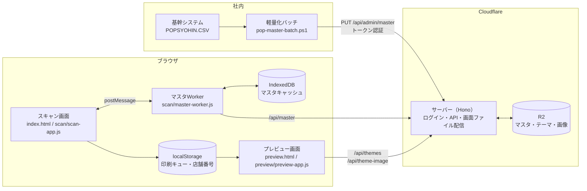
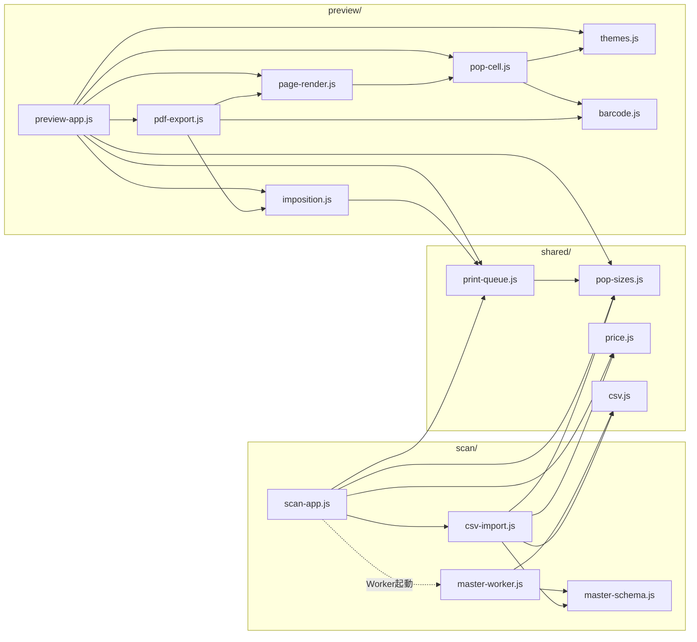

# POP作成システム 技術ドキュメント

Oct 4, 2026 · @tana（第5版：サーバーの Hono 化と独自ログイン、軽量化バッチによるマスタ連携、店舗別価格、商品リスト CSV の読み込みとミックスマッチ表示を反映）

## 概要

店頭の値札POPを、JANコードのスキャンから A4 面付けPDFまで一気に作るWebアプリです。商品マスタと POP デザイン（テーマ）は Cloudflare R2 に置き、サーバー（Hono で作った Cloudflare Worker）が API として配信します。画面の HTML・JS・CSS も同じサーバーから配信し、すべての画面と API は全社共通の ID・パスワードによるログインで守っています。

作業の流れは3段階です。

1. スキャン画面（index.html）でヘッダーに店舗番号を入れ、JAN をスキャン、または商品名で検索して印刷待機リストに追加する。商品リスト CSV を読み込んでリストを作ることもできる。マスタの内容に誤りがあれば、リスト上のフォームで修正し、規格ごとの枚数を指定する
2. プレビュー画面（preview.html）で面付けモードとデザインを選び、A4 ページの仕上がりを確認する
3. 「A4-PDFファイルを直接ダウンロード」でブラウザ内で PDF を生成して保存する

商品マスタは、基幹システムが出力する CSV（約220MB・全店舗分）を、社内 PC の PowerShell バッチで数MBに軽量化してからサーバーへ送ります。価格は店舗ごとに違うため、軽量化したマスタは「標準価格」と「標準と違う店舗だけの例外価格」で持ち、画面で入力した店舗番号に応じて切り替えます。

対応する POP 規格は A9タテ・A8ヨコ・A6ハーフ・A6ヨコ・A5ヨコ・A4ヨコ の6種類です。すべての POP の下部に JAN のバーコードと数字を印字します。PDF はすべてブラウザ側で生成するため、サーバー側に印刷処理はありません。

## システム構成

社内の軽量化バッチ、ブラウザ側で動く2画面とマスタWorker（Web Worker）、Cloudflare 側のサーバーと R2 の組み合わせです。2画面の間はサーバーを経由せず、localStorage で印刷リストを受け渡します。



スキャン画面は重い処理（マスタのダウンロード・解析・検索）をすべてマスタWorkerに任せ、postMessage で結果だけを受け取ります。サーバーはマスタ CSV をそのまま返すだけで、**CSV の解析と列名の解決はマスタWorkerの中で完結し、画面には変換済みの「商品データ」だけが渡されます**（形は「データ仕様」を参照）。プレビュー画面はマスタを使わず、印刷キュー（修正済み・CSV 読み込みの商品データを含む）と /api/themes のデザインだけで POP を描画します。

サーバーは、実行環境に依存しない本体（app.js）と、Cloudflare 固有の部分（入口 index.js・R2 の部品 storage/r2.js）に分けています。他のサービスに乗り換えるときは、入口とストレージの部品だけを作り直せば済みます。

## ファイル一覧と役割

ブラウザ側の JS はすべて ES モジュールで、画面ごとのフォルダと両画面共通の `shared/` に分かれています。HTML から直接読み込むのは各画面の入口1本だけで、残りは `import` で読み込まれます。

| 配置 | ファイル | 役割 |
| --- | --- | --- |
| / | index.html | スキャン画面。店舗番号・JAN入力欄・商品名検索・CSV 読み込み・印刷待機リスト |
| / | preview.html | A4面付けプレビュー・PDF出力画面 |
| /css/ | app.css | 両画面の画面部品（ヘッダー・店舗番号・入力欄・リスト・修正フォーム・CSV 読み込み結果・ボタン等） |
| /css/ | pop-styles.css | POPセルとA4用紙のスタイル、共通余白、サイズ別の文字・バーコード寸法、ミックスマッチ |
| /js/shared/ | pop-sizes.js | POP規格（6サイズ）・混載グリッド・既定サイズ・初期枚数・ミックスマッチを表示するサイズ |
| /js/shared/ | price.js | 税込価格の計算（税抜 × 税率の切り捨て） |
| /js/shared/ | print-queue.js | 印刷キューの保存・読込・枚数集計 |
| /js/shared/ | csv.js | CSV の解析（マスタWorker と CSV 読み込みで共有） |
| /js/scan/ | scan-app.js | スキャン画面の入口。画面操作・店舗番号・印刷リスト・修正フォーム・CSV 読み込みの画面・マスタWorkerとの通信 |
| /js/scan/ | master-worker.js | マスタの取得・解析・IndexedDBキャッシュ・JAN索引・店舗別価格・商品名検索（モジュールWorker） |
| /js/scan/ | master-schema.js | マスタの列定義と「マスタの行 → 商品データ」の変換。マスタWorker と CSV 読み込みで使う |
| /js/scan/ | csv-import.js | 商品リスト CSV の読み込み・検査・印刷キューの形への変換（DOM 非依存） |
| /js/preview/ | preview-app.js | プレビュー画面の入口。キュー読込・テーマ選択（商品ごとのデザインの解決）・描画・PDFボタン |
| /js/preview/ | themes.js | テーマ一覧の取得・画像URLの決定・配色の適用 |
| /js/preview/ | imposition.js | 面付け計算（DOM非依存）。A4用紙寸法 `PAGE_MM` もここで定義 |
| /js/preview/ | page-render.js | A4ページのDOM生成・A5回転配置（CSSの transform で回転）・空状態の案内。回転配置の目印クラスもここで定義 |
| /js/preview/ | pop-cell.js | POP 1枚分のDOM生成（通常価格・ミックスマッチ）・税抜価格の自動縮小 |
| /js/preview/ | barcode.js | JANバーコード（EAN-13/EAN-8）の符号化と要素生成。目印クラスもここで定義 |
| /js/preview/ | pdf-export.js | html-to-image + jsPDF によるPDF出力、バーコードのベクター描画 |
| サーバー | index.js | Cloudflare 用の入口。R2・画面ファイル配信・設定値の読み方を本体に渡す |
| サーバー | app.js | サーバー本体（Hono）。ログイン確認・各 API・画面ファイル配信。実行環境に依存しない |
| サーバー | auth.js | ログイン（署名付き Cookie）とアップロード用トークンの確認 |
| サーバー | login-page.js | ログイン画面の HTML（CSS も中に書く） |
| サーバー | storage/r2.js | ストレージ部品（R2 版） |
| 社内 PC | pop-master-batch.ps1 | マスタの軽量化とアップロード（PowerShell 5.1） |
| 社内 PC | pop-master-config.psd1 | バッチの設定（入力ファイル・作業フォルダ・送り先 URL など） |

サーバーのファイルは、wrangler.jsonc の `main` に指定したフォルダ（例: `worker/`）に、上の位置関係のまま置きます。画面ファイルのフォルダ（assets）の外に置いてください。

wrangler-account.json（Cloudflare アカウント情報）と cf.json（アクセス元の接続情報）はプログラム本体ではないため、この文書では扱いません。

## 機能説明: ログイン

- 全社共通の ID・パスワード1組でログインする。ログインしていないと、画面はログイン画面へ移動し、API は 401 を返す
- ログインに成功すると、署名付きの Cookie（JavaScript から読めない・HTTPS のみ・SameSite=Lax）を発行する。有効期限は `SESSION_DAYS`（既定 30日、1〜365日）
- Cookie の中身は「有効期限」と「ID・パスワードから作った目印」。パスワードを変えると目印が合わなくなり、全端末のログインが切れる
- ログイン失敗時は1秒待たせてから画面を戻す（総当たり対策）
- `/logout` を開くとログアウトする（画面にボタンはまだ無い）
- ログインしていないリクエストには、ストレージに触れずに小さな応答だけを返す（大量アクセスを受けても処理と通信量を小さく抑える）

ログイン不要なのは `/login`・`/logout`・`/api/admin/master`（トークンで認証）だけです。

## 機能説明: スキャン画面

マスタが使える状態になるまで入力欄と「CSVから読み込み」は無効で、使えるようになった時点（キャッシュ読込でも可）で JAN 入力欄へ自動でフォーカスします。

### 店舗番号

- ヘッダーの入力欄に店舗番号を入れる。端末ごとに localStorage（`pop_store_code`）へ記憶し、次回も同じ番号が入る
- 全角数字は半角にそろえる。番号の存在チェックはしない（店舗マスタを持たないため。新店でもすぐ使えるようにする）
- 価格は「その店舗の例外価格があればそれ、無ければ標準価格」。未入力なら標準価格で、欄が黄色になる
- 番号を変えると、リスト内の商品をその店舗の価格で取り直す。修正済みの行と CSV から読み込んだ行は取り直さない
- 入力欄で Enter を押すと確定し、JAN 入力欄に戻る

### JANコード連続スキャン

- Enter で確定すると入力欄を即座にクリアし、次のスキャンを受け付ける
- マスタWorker に `lookup` を依頼し、見つかればリスト先頭に追加、見つからなければ赤色の通知を4秒表示
- 同じ JAN を再スキャンすると新規行は作らず、既定サイズ（A9タテ）の枚数を +1 してその行を先頭へ移動する。修正フォームで直した内容はそのまま残る
- 新規追加時の初期枚数は既定サイズ 1枚、他のサイズは 0枚（既定サイズは shared/pop-sizes.js の `DEFAULT_SIZE_KEY`）

### 商品名あいまい検索

- 入力から 150ms 待ってから マスタWorker に `search` を依頼（入力のたびに検索しない）
- 最大20件の候補を表示し、クリックでリストに追加。追加後は JAN 入力欄にフォーカスを戻す
- 連番で古い検索結果を破棄するため、速く打っても表示が逆戻りしない

### 印刷待機リスト

- 1商品につき1枚のカードで、上段に JAN・補足（📄 CSV・ミックスマッチ・デザインID）・操作ボタン、中段に修正フォームと主要サイズの枚数欄、下段にオプションサイズの枚数欄を表示する
- 枚数欄は shared/pop-sizes.js の定義から自動生成する。`primary: true` のサイズ（A9タテ・A8ヨコ・A6ハーフ）は常時表示、それ以外（A6ヨコ・A5ヨコ・A4ヨコ）は「⚙️ 他サイズ」で開閉
- 既定サイズ（A9タテ）の枚数欄は強調表示
- 「全行のオプションサイズ表示切替」で全行を一括開閉
- 🗑️ で1行削除、「リストを全クリア」で確認のうえ全削除
- リストは変更のたびに localStorage（`pop_print_queue_v2`）へ保存され、ブラウザバックや再読み込みでも復元される
- 「印刷プレビュー・PDF出力画面へ進む」でリストを保存して preview.html へ移動

### 商品情報の修正フォーム

マスタの内容が正しくない場合に、印刷する POP の内容だけを画面上で直せます。

- 修正できる項目: 商品名・メーカー・コメント・数量1・数量2・医薬品区分・税抜価格・税込価格（POP に載る項目すべて）
- JAN は修正不可（同一商品の判定と「マスタの値に戻す」に使うため）
- 修正は入力欄から離れたとき（または Enter）に確定し、印刷キューに保存される。プレビュー・PDF にはこの内容が使われる
- 修正欄や枚数欄で Enter を押すと、確定してから JAN 入力欄にフォーカスが戻る（修正後そのまま次のバーコードを読んでも、修正欄に JAN が入らない）
- **税抜価格を直すと、その商品の税率で税込価格を自動計算する**（税抜 × (100 + 税率) ÷ 100 の切り捨て。基幹システムのマスタと同じ計算）。税率は税込価格欄の見出しに「（円・10%）」のように表示する。税率が無い商品は自動計算せず、両方を手入力する。税込価格を直しても税抜価格は変わらない
- 修正したカードは黄色になり「✏️ 修正済み」と「↺ マスタの値に戻す」が表示される。戻すボタンはマスタから同じ JAN の商品を今の店舗の価格で取り直す。CSV で指定したミックスマッチとデザインIDは残す
- 修正はこのリストの中だけで有効で、商品マスタは変更しない。行を削除・全クリアすると修正内容も消える

### 商品リスト CSV の読み込み

Excel で作った商品リストから、印刷待機リストをまとめて作ります。ミックスマッチ（◯個の価格）はマスタに無いため、この機能でだけ指定できます。

1. 「テンプレート」で見出し行だけの CSV（UTF-8 BOM 付き）をダウンロードし、Excel で入力して保存する（Shift-JIS の「CSV（コンマ区切り）」でよい）
2. 「📄 CSVから読み込み」でファイルを選ぶ
3. 結果欄に、読み込める件数・エラー（その行は読み込まない）・注意（読み込む）が行番号付きで出る。内容を確認して「置き換える」を押すと、**今のリストは消えて CSV の内容に置き換わる**

ルール（列の一覧は「データ仕様」を参照）:

- 文字コードは Shift-JIS。UTF-8 の BOM があれば UTF-8 として読む
- 見出しの列名で列を探す。並び順は自由で、使わない列は省略できる。全角・半角や空白の違いは無視する
- **「JAN のみ」の判定はファイル単位**。商品情報の列が JAN だけなら、商品情報をマスタ（画面の店舗の価格）から取る。マスタに無い JAN はエラー。商品情報の列があれば CSV の値だけを使い、未記入の欄は空欄のまま（マスタで補わない）
- ミックスマッチ・デザインID・枚数の列は「JAN のみ」の判定に含めず、どちらの場合でも使える
- 医薬品区分と税率は常にマスタから取る。マスタに無い商品は区分が空欄、税率なし
- マスタにある商品は、税込価格が「税抜 × 税率の切り捨て」と合うか確かめ、合わなければ注意を出す（通常価格・ミックス価格とも）
- 枚数の列が1つも無ければ、全商品を既定サイズ（A9タテ）1枚にする
- 読み込んだ行は「修正済み」扱いにしない。店舗番号を変えても価格を取り直さない
- JAN が指数表記（Excel で `4.90E+12` のように変わったもの）・桁数違いの行はエラー。チェックデジットが合わない JAN は注意（バーコードは印字されない）
- 未登録のデザインIDは注意を出し、印刷時は画面で選んだデザインを使う
- ミックスマッチがある商品に A9タテの枚数があると注意を出す（A9タテではミックスマッチを表示しない）

### マスタ状態の表示

ヘッダー右上のバッジにマスタWorkerの状態を表示します。Worker の状態と表示は1対1です。

| 状態 | 表示例 | 意味 | 入力 |
| --- | --- | --- | --- |
| （起動前） | ⏳ マスタ読み込み中... | HTMLの初期表示。scan-app.js がまだ動いていない | 無効 |
| loading | ⏳ マスタをダウンロード中... / 解析中... | キャッシュが無く初回取得中 | 無効 |
| checking | マスタ読込: n件（最新を確認中…） | キャッシュで利用開始、裏で最新確認中 | 有効 |
| synced | マスタ同期完了: n件 | 最新のマスタで利用中（304 または初回取得完了） | 有効 |
| updated | マスタ更新済み: n件 | キャッシュが古かったので最新に差し替えた | 有効 |
| offline | ⚠️ サーバー接続不可・保存済みマスタ使用中: n件 | オフライン・ログイン切れ等でキャッシュを継続使用 | 有効 |
| error | ⚠️ マスタ読み込み失敗 | キャッシュも無く取得にも失敗 | 無効 |

件数 n は商品の数（例外価格の行は数えない）です。「⏳ マスタ読み込み中...」のまま変わらない場合は、画面側のスクリプトが動いていません（「運用・保守メモ」のトラブルシューティングを参照）。

## 機能説明: 商品マスタWorker

マスタは「まず手元のキャッシュで即利用、裏でサーバーに最新確認」の方式で読み込みます。画面スレッドは一切マスタを持たないため、件数が多くても画面が固まりません。

モジュールWorkerとして、scan-app.js から `new Worker(new URL('./master-worker.js', import.meta.url), { type: 'module' })` で起動します。パスは scan-app.js からの相対指定なので、配置ディレクトリに依存しません。

### 初期化の流れ（`init` 受信時に1回だけ）

1. IndexedDB（DB名 `pop-master-cache`、ストア `master`、キー `current`）からキャッシュを読む
2. キャッシュが今の形式（必須列がそろっている）なら索引を作って即 `checking` を通知。無い・古い形式なら `loading` を通知
3. `/api/master` を `cache: 'no-store'` で取得。キャッシュがあればそのバージョンを `If-None-Match` に付ける
4. 304 なら `synced` を通知して終了。401（ログイン切れ）はエラーとして扱う
5. 200 なら CSV を解析（shared/csv.js）し、応答の ETag をバージョンとして `{ version, headers, rows }` を作る。必須列が無ければ形式エラー
6. 索引を作り直して `synced`（初回）または `updated`（差し替え）を通知し、IndexedDB に保存（保存失敗は警告のみ）
7. 通信やサーバーエラー時は、キャッシュがあれば `offline`、無ければ `error` を通知

IndexedDB には解析結果（`{ version, headers, rows }`）を保存します。商品データへの変換は検索結果を返すときに行うため、全件ぶんのオブジェクトを作り置きすることはありません。

### 索引と検索

- 索引作成時に、見出し行から各項目の列番号を1回だけ求め、以後は行ごとに列番号で値を読む（`createRowReader`）
- 商品行（I 行）: 正規化した JAN（全角→半角、空白・ハイフン除去）→ 行番号の Map と、商品名の索引を作る
- 例外価格行（P 行）: 「店舗番号＋JAN」→ 行番号の Map を作る
- `lookup` は JAN の完全一致で1件、`search` は商品名（NFKC 正規化 + 小文字化）の部分一致で先頭から最大 limit 件（既定20）を返す
- 返却時に、指定された店舗の例外価格があれば価格だけそれに差し替えて商品データに変換する。医薬品区分が「通常商品」なら空にする
- 新しい索引は作り終えてからまとめて差し替えるため、差し替え中の検索が中途半端な状態を見ることはない
- `lookup` と `search` は初回の索引作成が終わるまで待ってから処理する

### メッセージ仕様

| 方向 | type | 内容 |
| --- | --- | --- |
| 画面 → Worker | init | 初期化開始 |
| 画面 → Worker | lookup | `{ id, jan, store }`。store は店舗番号（空なら標準価格） |
| 画面 → Worker | search | `{ id, keyword, limit, store }` |
| Worker → 画面 | status | `{ state, count, message? }`。state は上の表の6種類 |
| Worker → 画面 | result | `{ id, data }`。data は商品データ（lookup）または商品データの配列（search）。見つからなければ null / 空配列 |

## 機能説明: プレビュー・面付け・PDF出力

プレビュー画面は「印刷キュー読込 → テーマ取得 → 面付け計算 → DOM描画 → 税抜価格の自動縮小」の順で動き、モードかデザインを変えるたびに面付けからやり直します。

- 印刷対象が0枚のときは、案内と「スキャン画面に戻る」ボタンを表示し、操作欄を無効にする
- テーマ一覧の取得に失敗したときは、状態欄に警告を出し、「標準」（テーマ指定なしの既定配色）で表示を続ける
- 状態欄には「商品 n件 ／ POP 合計 n枚 ／ A4 nページ」を表示する

### 面付けモード（imposition.js）

- **規格ごとに用紙を分ける**（separated）: サイズごとに POP を並べ、`cols × rows` 枚ずつ A4 に詰める。A5ヨコだけ A4タテ用紙、他は A4ヨコ用紙。サイズの順は shared/pop-sizes.js の定義順
- **1枚のA4に混載**（mixed）: A4ヨコを 8列×4行（1マス 37.125mm × 52.5mm）のグリッドとみなし、大きい規格から順に「左上から空いている場所」へ詰める（First Fit）。入らなければ新しいページを追加。A5ヨコは 4×4 マスの縦長枠に -90° 回転して配置

面付け結果は DOM に依存しない「ページ記述」（向き・列数・行数・マス寸法・配置リスト）として返すため、単体でテストできます。A4 用紙上のマス割りはミシン目に合わせてあり、余白を含めて変更しません（余白は各 POP の内側で取ります）。

### POPの描画（pop-cell.js / page-render.js / themes.js）

- 1枚の POP は上から コメント・メーカー名・商品名（最大2行）・数量1/数量2・税抜価格（黒丸「税抜」バッジ付き）・区切り線・税込価格・JANバーコードと数字・医薬品リスク区分（左寄せ） の順
- **ミックスマッチ**: 商品データに `mix` があり、サイズの `mixMatch` が true（A8ヨコ以上）なら、価格の部分を「1個 税抜〇〇円 (税込〇〇円)」の小さな1行と、その下の「◯個 税抜　〇〇円」（通常の価格と同じ大きさ）・区切り線・税込価格に置き換える。A9タテでは通常の価格だけを表示する。デザインは現行 POP に合わせて作り直す予定（「今後の課題」を参照）
- **デザイン（テーマ）**: 商品データに `themeId` があり、登録済みのテーマならそのデザインで描く。無い・未登録なら画面で選んだデザイン（page-render.js の `renderPage` にデザインを決める関数を渡す）
- 印刷キューの商品データ（修正済みの内容を含む）をそのまま使う
- **余白**: すべてのサイズで上下左右に最低 4mm（`--pop-safe-margin`）を確保する。プリンターの印刷できない範囲（用紙の端から約4mm）に文字や価格が掛からないようにするため。サイズ別の余白がこれより大きい場合（A6ヨコ・A5ヨコ・A4ヨコ）はそちらを使う
- **位置のそろえ**: コメント・医薬品区分・バーコードが無い（空欄の）POP でもその行の高さを確保するため、同じ用紙に並んだ POP の各項目の位置がそろう
- **税抜価格の自動縮小**: 価格が「税抜」バッジと並んで1行に入り切らない場合（桁の多い価格など）は、その POP の価格の数字だけを自動で縮める（最小で元の50%。「円」は縮めない）。描画後に `fitPopText` が行う。ミックスマッチの「◯個」の価格にも効く
- **「円」の文字サイズ**: 税抜価格と税込価格の「円」は同じ大きさ（`--pop-yen-size`、未指定なら税込価格と同じ）
- 画像は A9タテだけ上部、それ以外は左側。A9タテは専用画像（例: `sale.png` → `sale_a9.png`）を優先し、無ければ通常画像、それも無ければ画像エリアを消す
- テーマの `bgColor`・`commentColor`・`priceColor` を CSS 変数として POP ごとに上書き
- マス寸法は `1fr` ではなく mm で固定し、中身によるズレを防ぐ

### 文字サイズの考え方（css/pop-styles.css）

A版の用紙が相似形であることを利用し、A8ヨコを基準に用紙の拡大率で文字サイズを決めています（A6ヨコ＝2倍、A5ヨコ＝約2.83倍、A4ヨコ＝4倍）。こうすると、どのサイズも同じバランスに見えます。

- 税込価格は税抜価格の約4割の大きさにし、区切り線の上下とバーコードの前に余白を取って読みやすくする（総額表示で税込価格がはっきり分かるようにするため）
- A9タテは縦長で画像が上にあるため個別に調整。A6ハーフは高さが A8 と同じなので文字は A8 並みにし、横幅の余裕で税抜価格だけ少し大きくする
- バーコードの寸法は読み取りやすさで決めているため、文字と一緒には拡大しない
- いちばん詰まるケース（画像・コメントあり、商品名2行、医薬品区分あり）で縦横とも欄に収まることを確認済み。A9タテ・A8ヨコ・A6ハーフは高さの余裕が 0.5〜3mm しかないため、文字サイズや余白を増やすときは他の項目を減らして釣り合いを取る

| サイズ | コメント | メーカー | 商品名 | 数量 | 税抜 | 税込・円 | 医薬品区分 |
| --- | --- | --- | --- | --- | --- | --- | --- |
| A9タテ | 8 | 8 | 12.5 | 8 | 26 | 12 | 6 |
| A8ヨコ（基準） | 9 | 8 | 13 | 8 | 36 | 15 | 7.5 |
| A6ハーフ | 9 | 8 | 13 | 8 | 40 | 16 | 7.5 |
| A6ヨコ（×2） | 18 | 16 | 26 | 16 | 72 | 30 | 15 |
| A5ヨコ（×2.83） | 25 | 23 | 37 | 23 | 100 | 42 | 21 |
| A4ヨコ（×4） | 36 | 32 | 52 | 32 | 144 | 60 | 30 |

単位は px。A9タテは画像エリアの最大高さも 9mm → 7mm に下げて、税込価格まわりの余白を確保しています。

### JANバーコード（barcode.js）

外部ライブラリは使わず、自前で符号化しています。

| JAN の桁数 | 扱い |
| --- | --- |
| 13桁 | チェックデジットが正しければ EAN-13 |
| 12桁 | UPC-A として正しければ先頭に 0 を付けて EAN-13 |
| 8桁 | チェックデジットが正しければ EAN-8 |
| それ以外・チェックデジット誤り | バーコードにせず数字だけを表示（読めないバーコードを印刷しないため）。高さはバーコードありと同じ |

- 画面上は SVG で表示し、線1本ごとの情報（`data-bits`）を持たせる
- 線の太さは JAN 規格の最小倍率 0.8 倍以上（A9 約0.83倍 〜 A4 約1.6倍）。高さは規格より低い短縮寸法（A9で5mm）
- 左右の白い余白（クワイエットゾーン: EAN-13 は左11・右7モジュール、EAN-8 は左右7モジュール）を含めた全体が欄に入り切らない場合は、線が切れないように全体を縮めて収める
- A9 は欄が狭いため、クワイエットゾーンだけが POP の余白側へ最大 1.5mm 入ってよい（`--pop-barcode-bleed`）。黒い線は 4mm の内側に収まる

### PDF出力（pdf-export.js）

html-to-image でページを画像化します。html-to-image はブラウザ自身の描画（SVG foreignObject）をそのまま画像にするため、PDF の見た目がプレビューと一致します。以前使っていた html2canvas は CSS を独自に解釈して描き直すため、文字の位置・サイズが画面とずれていました。

1. Webフォントとテーマ画像の読み込み完了を待つ。フォント埋め込み用の CSS は最初に1回だけ作り、全ページで使い回す
2. バーコードの線（SVG）を一時的に非表示にする。要素を取り除くと下の数字が上に詰まってずれるため、場所は残したまま `visibility: hidden` にする
3. ページごとに html-to-image で画像化（倍率2、JPEG品質0.95）し、jsPDF で A4 に貼る。画面表示用に縮小していても本来の A4 寸法で撮る。回転配置（A5ヨコの混載）もブラウザがそのまま描くので、別撮影は不要
4. バーコードの線を jsPDF の長方形としてベクターで描く。画面上の配置から位置（mm）を求め、回転配置の中のものは向きを変えて描く。JPEG 化によるにじみでスキャナーが読めなくなるのを防ぐため
5. 非表示にしたバーコードの線を元に戻し、`POP_Print_YYYY-MM-DD.pdf` として保存。日付は端末の現地時刻（日本時間）

Safari（iPad 等）は1回目の描画で画像やフォントが欠けることがあるため、Safari のときだけ各ページを2回描画して2回目を使います。作成中は画面のバーコードが一瞬消えますが、終わると元に戻ります。

作成中はボタンが「⏳ PDFを作成中...」になり、二重押しできません。失敗した場合は理由をダイアログで表示します。

## サーバー仕様（Hono）

サーバー本体（app.js）は Hono で作り、Cloudflare 固有のものを直接使いません。実行環境ごとの違いは、入口（index.js）が渡す3つの部品に閉じ込めています。

| 部品 | Cloudflare での中身 | 内容 |
| --- | --- | --- |
| `getStorage(c)` | storage/r2.js（R2 バインディング `MY_R2_BUCKET`） | `head`・`get`・`put`・`list`・`delete` の5つを持つストレージ部品 |
| `serveAsset(c)` | `env.ASSETS.fetch()` | 画面ファイル（HTML・JS・CSS・画像）を返す |
| `getEnv(c, name)` | `c.env[name]` | 設定値・シークレットを読む |

`c` は Hono がリクエストごとに作るコンテキストです。画面ファイルもログイン確認を通すため、wrangler.jsonc の assets で `run_worker_first: true` にしています（すべてのリクエストがサーバーを通る）。

| URL | ログイン | 内容 |
| --- | --- | --- |
| GET /login・POST /login・GET /logout | 不要 | ログイン画面・ログイン・ログアウト |
| PUT /api/admin/master | 不要（トークン） | 軽量化バッチからのマスタ受け取り |
| GET /api/master | 必要 | マスタ CSV をそのまま返す。ETag + `private, no-cache`、一致すれば 304 |
| GET /api/themes | 必要 | `themes/manifest.json` を JSON で返す（`private, no-cache`） |
| GET /api/theme-image/:filename | 必要 | `images/<filename>` の画像（`private, max-age=86400`） |
| 上記以外の GET | 必要 | 画面ファイル |

エラー時は理由を外に出さず「サーバーでエラーが発生しました」とだけ返し、詳細はログ（`console.error`）に出します。

### /api/master の処理

1. ストレージの `head` でマスタの etag だけを取得（本文は読まない）
2. ETag を `"v4-<etag>"` の形で作る（`v4` は app.js の `MASTER_FORMAT`）。`If-None-Match` と一致すれば 304（`W/` は無視して比較）
3. 一致しなければ、ストレージから本文を流すだけで返す（サーバーでは解析しない）。手順1と3の間に更新された場合に備え、ETag は実際に読んだ版のものを使う

以前のエッジキャッシュ（Cache API）と、サーバーでの文字コード変換・CSV 解析は、マスタを軽量化したことで不要になり廃止しました。キャッシュは IndexedDB＋ETag/304 の1層で、各端末が毎回マスタをダウンロードしないためのものです。

### PUT /api/admin/master の処理

1. `Authorization: Bearer <トークン>` を `UPLOAD_TOKEN` と比べる（ハッシュにしてから全バイトを比べ、処理時間で中身が推測されないようにする）。未設定なら 503、違えば 401
2. サイズ（上限 50MB）・UTF-8 か・1行目が見出し（`MASTER_HEADER`）と一致するか・2行目以降が I 行か P 行かを確認。問題があれば 400
3. 今のマスタを `masters/backup/pop-master-<日時>.csv` に退避し、新しい順に7件だけ残す
4. 新しいマスタを保存し、`{ ok: true, items, exceptions, bytes }` を返す

### /api/theme-image の安全対策

ファイル名に `/`・`\`・`..` が含まれる場合は 400 を返し、`images/` 以外のファイルを読めないようにしています。

## 軽量化バッチ（pop-master-batch.ps1）

基幹システムの CSV を軽量化し、サーバーへ送ります。PowerShell 5.1（`powershell.exe`）で動かします。7（`pwsh.exe`）でも動きますが、本番のタスクスケジューラは 5.1 です。

### 処理の流れ

1. 入力 CSV（Shift-JIS・見出し無し・27列、1行＝1店舗×1商品）を1行ずつ読む。基幹システムが書き込み中で開けなければエラー（次回の実行で処理される）
2. 行を検査する。「"」を含む行・列数が27でない行が1つでもあれば中止。JAN（8/12/13桁の数字）・店舗コード・価格が不正な行は除外し、件数と行番号をログに出す
3. 商品ごとにまとめ、店舗間で最も多い価格を標準価格とする（同数なら税込が安いほう）。標準と違う店舗だけを例外価格とする
4. UTF-8（BOM 無し）で出力する。商品数が前回アップロード時の `MinItemRatio`（既定 0.8）未満なら中止（入力ファイルが途中で切れている場合に備える）
5. 前回アップロードした内容と同じなら送らない。違えば `PUT /api/admin/master` に送る。失敗時は30秒おきに最大3回やり直す（認証エラーや内容の問題はすぐ止める）。サーバーの `{"ok":true}` を確認して成功とする

処理時間の目安は 20万行で約5秒です。

### 入力ファイルのレイアウト（使う列だけ）

| 列番号（0始まり） | 列名 | 使い方 |
| --- | --- | --- |
| 2 | 店舗コード | 店舗番号 |
| 4 | スキャニングコード | JAN |
| 7 | 税率 | 税率（%） |
| 10 / 11 | 売単価(税抜) / 売単価(税込) | 価格 |
| 20 | POP用メーカー名 | メーカー |
| 21 | POP用商品名 | 商品名 |
| 22 | POP用規格名 | 数量1 |
| 23 | 自由入力欄1 | 数量2 |
| 24 | 自由入力欄2 | コメント |
| 25 | 自由入力欄3 | 医薬品区分（POP 印字用の表記。医薬品以外は「通常商品」） |

値の前後の空白（全角を含む）は取り除きます。列の位置はスクリプト冒頭の `$COL_*` で変えられます。

### 使い方

| 実行のしかた | 用途 |
| --- | --- |
| `powershell.exe -NoProfile -ExecutionPolicy Bypass -File "<パス>\pop-master-batch.ps1"` | 通常の実行（タスクスケジューラに登録する形） |
| 上に `-NoUpload` | 変換だけ行い、送らない（動作確認用） |
| 上に `-Force` | 商品数の急減チェックと「前回と同じなら送らない」を無視する |
| 上に `-SaveToken` | アップロード用トークンを保存する（初回・入れ替え時） |

- `-ExecutionPolicy Bypass` はその1回の実行だけ制限を外す。PC の実行ポリシーは変えない
- トークンは Windows の DPAPI で暗号化して作業フォルダの `upload-token.dat` に保存する。**保存した Windows ユーザー・その PC でしか読めない**ため、タスクスケジューラも同じユーザーで実行する
- 右クリックの「PowerShell で実行」は使わない（終了と同時に画面が閉じ、オプションも付けられない）。手動で動かすときはターミナルか .bat から実行する

### 作業フォルダ（`WorkDir`）のファイル

| ファイル | 内容 |
| --- | --- |
| pop-master.csv / pop-master.prev.csv | 今回・前回の出力 |
| state.json | 前回アップロードした内容のハッシュ・商品数・日時 |
| upload-token.dat | 暗号化したトークン |
| access-secret.dat | （旧 Cloudflare Access 用。今は使わない） |
| logs/pop-master-YYYYMMDD.log | ログ（90日で自動削除） |

作業フォルダは、店舗スタッフが触れない場所にしてください。

## 依存関係

依存のルールは2つです。

- 読み込みの向きは「入口 → 各機能 → shared」の一方通行。shared は画面側のファイルを読まない
- スキャン画面（scan/）とプレビュー画面（preview/）は互いを読まず、shared を介してだけつながる

すべて `import` による明示的な依存で、循環はありません。HTML の script タグの読み込み順を気にする必要もありません。

### モジュール依存（矢印は import の向き）



サーバー側は index.js → app.js → auth.js・login-page.js、index.js → storage/r2.js の一方通行です。app.js はストレージ部品を import せず、入口から受け取ります。

定数は「それを決めるファイル」に置き、使う側が import します。A4 用紙寸法 `PAGE_MM` は imposition.js、回転配置の目印クラスは page-render.js、バーコードの目印クラスは barcode.js にあり、pdf-export.js はそれぞれから読み込みます（回転配置は、バーコードの向きを判定するために `ROTATE_INNER_CLASS` だけを使います）。

pdf-export.js は、preview.html が同期読み込みする html-to-image・jsPDF をグローバル変数（`htmlToImage`・`jspdf.jsPDF`）として使います。この2つだけは preview-app.js より前に script タグで読み込む必要があります。

### 外部ライブラリ・サービス

| 名前 | 版 | 読み込み元 | 使う場所 |
| --- | --- | --- | --- |
| Hono | 4 系 | npm（`npm install hono`。デプロイ時に wrangler が1ファイルにまとめる） | サーバー本体（ルーティング・署名付き Cookie） |
| html-to-image | 1.11.11 | cdn.jsdelivr.net | PDF出力（ページの画像化） |
| jsPDF | 2.5.1 | cdnjs.cloudflare.com | PDF出力（A4生成・バーコードのベクター描画） |
| Cloudflare Workers | 無料プラン | — | サーバーの実行環境・画面ファイル配信。1日10万リクエストを超えると課金されずに止まる |
| Cloudflare R2 | — | バインディング `MY_R2_BUCKET` | マスタ・バックアップ・テーマ・画像の保管 |

CSS フレームワークとバーコードライブラリは使っていません。ブラウザ機能としては ES モジュール・モジュールWorker・IndexedDB・localStorage・fetch・TextDecoder（Shift-JIS）・SVG を使います。

## データ仕様

### POP規格（shared/pop-sizes.js）

| キー | 表示名（label） | POP寸法 | 1ページの面数 | 用紙 | 画像位置 | 混載時のマス（幅×高さ） | 常時表示（primary） | ミックスマッチ（mixMatch） |
| --- | --- | --- | --- | --- | --- | --- | --- | --- |
| a9 | A9タテ | 37.125 × 52.5 mm | 32（8×4） | A4ヨコ | 上 | 1 × 1 | ○（既定サイズ） | — |
| a8 | A8ヨコ | 74.25 × 52.5 mm | 16（4×4） | A4ヨコ | 左 | 2 × 1 | ○ | ○ |
| a6half | A6ハーフ | 148.5 × 52.5 mm | 8（2×4） | A4ヨコ | 左 | 4 × 1 | ○ | ○ |
| a6 | A6ヨコ | 148.5 × 105 mm | 4（2×2） | A4ヨコ | 左 | 4 × 2 | — | ○ |
| a5 | A5ヨコ | 210 × 148.5 mm | 2（1×2） | A4タテ | 左 | 4 × 4（90°回転） | — | ○ |
| a4 | A4ヨコ | 297 × 210 mm | 1 | A4ヨコ | 左 | 8 × 4 | — | ○ |

pop-sizes.js には他に、既定サイズ `DEFAULT_SIZE_KEY`（`a9`）と初期枚数を作る `createDefaultCounts()` があります。税込価格の計算 `calcPriceIncl(税抜, 税率)` は shared/price.js にあります（税率が無ければ null を返し、計算しない。既定の税率は持たない）。

### POPの見た目の設定（css/pop-styles.css）

| CSS変数 | 場所 | 内容 |
| --- | --- | --- |
| `--pop-safe-margin` | `:root` | 全サイズ共通の最低余白（上下左右、既定 4mm） |
| `--pop-pad-y` / `--pop-pad-x` | `.pop-size-*` | サイズ別の余白。共通余白より大きい場合だけ使われる（A6ヨコ・A5ヨコ・A4ヨコ） |
| `--pop-*-size` | `.pop-size-*` | 各項目の文字サイズ |
| `--pop-yen-size` | `.pop-size-*`（任意） | 税抜・税込共通の「円」の文字サイズ。未指定なら税込価格と同じ |
| `--pop-tax-incl-lh` | `.pop-size-*` | 税込価格の行間（既定 1.05） |
| `--pop-divider-mt` / `--pop-divider-mb` | `.pop-size-*` | 区切り線の上・下の余白（既定 0.5mm / 0.3mm） |
| `--pop-risk-pad` | `.pop-size-*` | 医薬品区分の上下の内側余白（既定 0.3mm） |
| `--pop-img-max-h` | `.pop-size-a9` | 上部画像エリアの最大高さ |
| `--pop-barcode-w` | `.pop-size-*` | バーコード本体（95モジュール）の幅 |
| `--pop-barcode-h` | `.pop-size-*` | バーコードの線の高さ |
| `--pop-barcode-text-size` | `.pop-size-*` | バーコード下の数字の文字サイズ |
| `--pop-barcode-gap` | `.pop-size-*` | バーコードの上の余白 |
| `--pop-barcode-bleed` | `.pop-size-a9` | クワイエットゾーンが余白側へ入ってよい幅 |
| `--pop-mix-single-size` | `.pop-size-*`（任意） | ミックスマッチの「1個」の行の文字サイズ（既定は税込価格の 0.75 倍） |
| `--pop-mix-qty-size` / `--pop-mix-tax-label-size` | `.pop-size-*`（任意） | ミックスマッチの「◯個」「税抜」の文字サイズ（既定は「税抜」バッジの 1.7 倍・1.2 倍） |

### 商品マスタ（軽量化バッチの出力、R2 `masters/pop-master.csv`）

UTF-8（BOM 無し）・見出し付きの CSV です。列名はバッチ・app.js の `MASTER_HEADER`・master-schema.js の `COLUMNS` で同じにそろえています。

```
type,jan,store,taxRate,priceExcl,price,maker,name,qty1,qty2,comment,risk
I,4901080224019,,10,598,657,アース製薬,はだまもミスト,,２００ｍｌ,,通常商品
P,4901080224019,7711,,648,712,,,,,,
```

| 行の種別 | 内容 |
| --- | --- |
| I（商品行） | 1商品1行。共通項目と標準価格。store は空 |
| P（例外価格行） | 標準価格と違う店舗だけ。jan・store・priceExcl・price だけが入る |

master-schema.js は見出しの名前で列を探すため、列の並びが変わっても動きます。全列が必須で、1つでも無ければ形式エラーになります。

### 商品データ（マスタWorker → 画面、印刷キュー内）

画面側で扱う唯一の商品の形です。スキャン画面の修正フォームはこの値を書き換えます。

| 項目 | 型 | 内容 |
| --- | --- | --- |
| jan | 文字列 | 正規化済みの JAN |
| name / maker | 文字列 | 商品名・メーカー名 |
| priceExcl / price | 数値 | 税抜価格・税込価格（店舗の例外価格があればそちら） |
| taxRate | 数値 または null | 税率（%）。null なら修正フォームで税込を自動計算しない |
| comment / qty1 / qty2 | 文字列 | コメント・数量1・数量2 |
| risk | 文字列 | 医薬品リスク区分（「通常商品」は空） |
| mix | オブジェクト または null | CSV 読み込みのみ。ミックスマッチ `{ qty, priceExcl, price }`（◯個の数量・税抜・税込） |
| themeId | 文字列 | CSV 読み込みのみ。デザインID（空なら画面で選んだデザイン） |

### 印刷キュー（localStorage `pop_print_queue_v2`、shared/print-queue.js）

```json
[
  {
    "item": {
      "jan": "4901080224019", "name": "…", "maker": "…",
      "priceExcl": 598, "price": 657, "taxRate": 10,
      "comment": "", "qty1": "", "qty2": "", "risk": "",
      "mix": { "qty": 3, "priceExcl": 1500, "price": 1650 }, "themeId": "sale"
    },
    "counts": { "a9": 0, "a8": 1, "a6half": 0, "a6": 0, "a5": 0, "a4": 0 },
    "showOptions": false,
    "edited": false,
    "source": "csv"
  }
]
```

`item` は上記の商品データ、`edited` は修正フォームで修正したかどうか、`source` は CSV から読み込んだ行なら `"csv"`（スキャンした行には無い）です。値は例です。読み込み時は、形の壊れた行（`item.jan` が無い・`counts` が無い）を除き、サイズ追加などで欠けた枚数欄を 0 で補います。第4版以前の行（`priceExclAuto` あり・`taxRate` 無し）もそのまま読めます。

localStorage には、印刷キューのほか店舗番号（`pop_store_code`、scan-app.js が読み書き）を保存しています。

### 商品リスト CSV（スキャン画面の読み込み）

| 種類 | 列名（別名） | 内容 |
| --- | --- | --- |
| 商品情報 | JAN（JANコード） | 必須。8・12・13 桁の数字 |
| 商品情報 | 商品名・メーカー（メーカー名）・税抜価格・税込価格・数量1・数量2・コメント | 1つでもあれば「JAN のみ」ではない |
| ミックスマッチ | ミックス数量・ミックス税抜価格・ミックス税込価格 | 1つでも書けば3つとも必須。数量は2以上 |
| デザイン | デザインID | テーマの `id` |
| 枚数 | A9タテ枚数（A9枚数）・A8ヨコ枚数（A8枚数）・A6ハーフ枚数（A6HALF枚数）・A6ヨコ枚数（A6枚数）・A5ヨコ枚数（A5枚数）・A4ヨコ枚数（A4枚数） | 0 以上の整数。空欄は 0 |

列名は csv-import.js の冒頭にまとめてあります。枚数の列名は pop-sizes.js の `label` から自動で作るため、サイズを追加すると列も増えます。価格の「1,000」「¥1000」「１０００円」などは数値として読みます。

### テーマ（R2 `themes/manifest.json`）

コードが読んでいる項目から見た形式です。配列で、先頭のテーマが初期選択になります。将来は Web の管理画面から作成できるようにする予定のため、R2 に置いています。

| 項目 | 内容 |
| --- | --- |
| id | テーマの識別子（選択肢の値） |
| name | 選択肢の表示名。無ければ id を表示 |
| image | 画像ファイル名（R2 の `images/` 配下）。省略すると画像なし |
| bgColor | POP の背景色 |
| commentColor | コメントの文字色 |
| priceColor | 税抜価格の文字色 |

## 運用・保守メモと注意点

### サーバーの設定値

| 名前 | 種類 | 既定値 | 内容 |
| --- | --- | --- | --- |
| MY\_R2\_BUCKET | R2バインディング | なし（必須） | マスタ・テーマ・画像を置くバケット |
| ASSETS | 画面ファイルのバインディング | なし（必須） | wrangler.jsonc の assets（`run_worker_first: true`） |
| LOGIN\_USER | シークレット | なし（必須） | ログイン ID |
| LOGIN\_PASSWORD | シークレット | なし（必須） | パスワード。変えると全端末のログインが切れる |
| SESSION\_SECRET | シークレット | なし（必須） | ログイン Cookie の署名の鍵（長いランダムな文字列） |
| UPLOAD\_TOKEN | シークレット | なし | バッチのアップロード用トークン。未設定ならアップロードを受け付けない |
| SESSION\_DAYS | vars | 30 | ログインの有効日数（1〜365） |
| MASTER\_STORAGE\_KEY | vars | masters/pop-master.csv | マスタの置き場所 |

シークレットは `npx wrangler secret put <名前>` で登録します（値は登録後に誰も見られません）。LOGIN\_USER と LOGIN\_PASSWORD は、スタッフに伝える必要があるため社内のパスワード管理の決まりに沿って控えておきます。SESSION\_SECRET と UPLOAD\_TOKEN は忘れても作り直せば済みます。

ランダムな文字列は PowerShell の次の1行で作れます。

```powershell
$b = New-Object byte[] 32; [Security.Cryptography.RandomNumberGenerator]::Create().GetBytes($b); [Convert]::ToBase64String($b)
```

他のサービスに移るときは、同じ名前の設定値を移行先に登録し直し、入口（index.js 相当）で読み方を合わせます。

### 手元での開発（wrangler dev）

- 本番のシークレットは使われない。wrangler.jsonc と同じフォルダに `.dev.vars` を作り、`名前=値` で書く（LOGIN\_USER・LOGIN\_PASSWORD・SESSION\_SECRET は必須、UPLOAD\_TOKEN はアップロードを試すときだけ）。値は本番と違うテスト用にし、**.gitignore に入れる**
- ログイン Cookie は HTTPS 用の設定なので、確認は Chrome か Edge で行う（`http://localhost` を例外として扱うため）
- 既定では手元の空の R2 を使う。本番の R2 で確かめるときは `npx wrangler dev --remote`
- 普通の `wrangler dev` は Cloudflare の利用量に数えられない

### 文字コードと改行コード

| ファイル | 文字コード | 改行 |
| --- | --- | --- |
| JS・HTML・CSS・JSON・Markdown | UTF-8（BOM 無し） | LF |
| PowerShell（.ps1・.psd1） | UTF-8（**BOM 付き**。無いと 5.1 が日本語を読み違える） | CRLF |
| 基幹システムの CSV | Shift-JIS（そのまま） | そのまま |

ルールはリポジトリの `.gitattributes`（git の変換）と `.editorconfig`（エディタ）に書いて共有します。基幹システムの CSV は社内情報なので git に入れません。

### よくある作業

- **マスタを更新する**: 通常はバッチが自動で行う。各端末は次に画面を開いたとき ETag の変化を検知して自動で差し替える。手動で送るときは `-Force` 付きでバッチを実行する
- **バッチを試す**: `-NoUpload` で変換だけ行い、ログの件数を確かめる。異常系の試験で商品数が減る場合は、作業フォルダの state.json を消すか `-Force` を付ける
- **基幹システムの列の位置が変わった**: pop-master-batch.ps1 の冒頭の `$COL_*` を直す。サーバーと画面は変更不要
- **POP に表示する項目を増やす**: バッチの出力列・app.js の `MASTER_HEADER`・master-schema.js の `COLUMNS` と `toItem` に追加し、preview/pop-cell.js の描画と scan/scan-app.js の `EDIT_FIELDS`（修正フォーム）に加える。CSV 読み込みで扱うなら csv-import.js の列にも加える
- **POP のサイズを追加する**: shared/pop-sizes.js に1件追加（`label`・`primary`・`mixMatch` を含む）し、css/pop-styles.css に `.pop-size-*`（文字サイズ・バーコード寸法）を追加する。スキャン画面の枚数欄と CSV の枚数列は自動で増える
- **ミックスマッチを表示するサイズを変える**: shared/pop-sizes.js の `mixMatch`
- **既定サイズを変える**: shared/pop-sizes.js の `DEFAULT_SIZE_KEY`
- **POP の余白を変える**: css/pop-styles.css の `--pop-safe-margin`（全サイズに反映）
- **文字サイズを変える**: css/pop-styles.css の `.pop-size-*`。バランスを保ったまま大きさを変えるときは、A8ヨコの値に倍率を掛けて決める（「文字サイズの考え方」を参照）。確認は画像ありのテーマで商品名が2行になる商品を使う
- **バーコードが読みにくい**: css/pop-styles.css のサイズ別 `--pop-barcode-h`（高さ）・`--pop-barcode-w`（幅）を大きくする。幅は 25.1mm（0.8倍）未満にしない
- **POP に出さない医薬品区分を増やす**: scan/master-schema.js の `HIDDEN_RISK_LABELS`
- **ログインの有効期限を変える**: vars の `SESSION_DAYS`
- **パスワードを変える**: `npx wrangler secret put LOGIN_PASSWORD`（全端末が再ログインになる）
- **アップロード用トークンを入れ替える**: 新しい文字列を `npx wrangler secret put UPLOAD_TOKEN` で登録し、バッチ側でも `-SaveToken` で保存し直す
- **マスタの応答形式を変えた**: app.js の `MASTER_FORMAT`（現在 `v4`）を上げると、全端末のキャッシュが入れ替わる
- **印刷キューの形を変えた**: shared/print-queue.js の `QUEUE_STORAGE_KEY` の末尾の番号を上げる（古い形式のキューは読まれなくなる）
- **ストレージや実行環境を変える**: storage/r2.js と同じ5つの処理を持つ部品と、入口（index.js 相当）を作る。app.js と画面側は変更不要
- **マスタを前の版に戻す**: R2 の `masters/backup/` から目的の版を `masters/pop-master.csv` として置き直す

### デプロイ時の注意

- HTML と JS は必ずセットで差し替える。古い HTML は古い場所・古い形式で JS を読むため、何も動かなくなる
- サーバーは `npm install hono` を wrangler.jsonc のあるフォルダで実行してからデプロイする。wrangler.jsonc の `main` が入口（index.js）を指し、assets に `binding: "ASSETS"` と `run_worker_first: true` があることを確認する
- ファイルを移動・改名した版を反映するときは、サーバー上の旧ファイルを削除する（第5版で不要になったもの: 旧サーバーの index.js 1本構成。第3版の構成整理で不要になったもの: `js/pop-config.js`・`js/master-schema.js`・`js/master-worker.js`・`js/scan-app.js`・`js/preview.js`・`js/preview/constants.js`・`js/preview/data.js`）
- 差し替え後は各端末で強制再読み込み（Ctrl+Shift+R、Mac は Cmd+Shift+R）を行い、古い HTML がキャッシュから使われていないことを確認する

### トラブルシューティング

**マスタの読み込みが終わらない**

| バッジの表示 | 状況 | 確認すること |
| --- | --- | --- |
| ⏳ マスタ読み込み中... | scan-app.js が動いていない | コンソールに `Cannot use import statement outside a module` / `Unexpected token 'export'` や 404 が出ていないか。HTML が古いまま・キャッシュされていないか |
| マスタをダウンロード中... / 解析中... | `/api/master` の応答待ち | 開発者ツールのネットワークタブで `/api/master` の状態・応答サイズ |
| ⚠️ マスタ読み込み失敗 | 取得に失敗 | `/api/master` が 401（ログイン切れ → 再読み込みしてログイン）・404（マスタ未アップロード）でないか。コンソールに「形式が不正」と出ていれば、マスタの見出し行を確認 |
| ⚠️ マスタ処理でエラーが発生しました | マスタWorker自体の読み込み失敗 | `/js/scan/master-worker.js`・`/js/scan/master-schema.js`・`/js/shared/csv.js` が 404 でないか。モジュールWorker非対応のブラウザ（iOS 15 未満の Safari 等）でないか |

**ログインできない**

- 「ログインの設定がされていません」: LOGIN\_USER・LOGIN\_PASSWORD・SESSION\_SECRET のどれかが未登録（手元なら `.dev.vars`）
- ログインしてもログイン画面に戻される: 手元の確認を Safari で行っていないか（Chrome か Edge を使う）

**バッチのアップロードが失敗する**（ログの WARN 行に状態コード・送信先・応答が出る）

| 状態コード | 原因 |
| --- | --- |
| 302 | サーバーに届く前に別の仕組み（以前の Cloudflare Access など）が転送している。`curl.exe -i -X PUT <送信先>` の `Location:` で転送先を確かめる |
| 401 | トークンがサーバーとバッチで違う。両方を登録し直す |
| 404 | 送信先 URL がサーバーの受付と合っていない（例の URL のまま、末尾の `/`、ドメイン違い）。ログイン後にブラウザで開いて「PUT で送信してください。」と出る URL を設定する |
| 400 | 出力ファイルの形式違い。応答に理由が出る |
| 503 | サーバーに UPLOAD\_TOKEN が未登録 |

**バッチが PowerShell 5.1 だけで失敗する**

- 文字化け・構文エラー: .ps1・.psd1 が BOM 付き UTF-8 で保存されているか（メモ帳で保存し直すと BOM が外れることがある）
- 「Join-Path … 空の文字列」: 第5版の修正前のスクリプト（クラス定義があると param 部分で `$PSScriptRoot` が空になる 5.1 の不具合）。最新版に差し替える

**バーコードが表示されず数字だけになる**

JAN の桁数が 13・12・8 桁以外か、末尾のチェックデジットが合っていません（例: `4901234567890` は正しくは `4901234567894`）。読めないバーコードを印刷しないための仕様です。マスタの JAN を正しい値に直してください。

### 注意点

- 無料プランは1日10万リクエストまで。画面ファイルもサーバーを通すため、画面を1回開くと20回前後のリクエストになる（50店舗×1日20回で約2万回）。上限を超えると課金されずにエラーで止まる
- バッチが失敗しても各端末は前回のマスタで動き続けるため、気づかないまま古い価格が続くことが一番の危険。ログを確認する担当を決めておく
- 標準価格は「最も多くの店舗で使われている価格（同数なら安いほう）」。例外価格の無い店舗（新店を含む）はすべて標準価格になる
- プレビュー画面は html-to-image・jsPDF を外部 CDN から読むため、インターネット接続が必要です。2ファイルを `/js/vendor/` に置いて preview.html の URL を差し替えれば、外部 CDN への依存はなくなります
- マスタ内に同じ JAN の商品行が複数あると、後ろの行だけが検索対象になります（バッチは同じ店舗・JAN の重複を後の行で上書きする）
- A9タテは余白 4mm を取ると欄が狭く、長い商品名は2行で打ち切られます。必要に応じて修正フォームで短くしてから印刷してください
- 印刷した POP のバーコードは、導入時に店舗のスキャナーで各サイズ（特に A9）が読めるかを確認してください
- テーマを管理画面から保存できるようにする際は、manifest.json 1ファイルに全テーマを持つ現在の形だと、同時編集で後勝ちになる点に注意（テーマ1件＝1ファイルにする、ETag で競合を検出する等）
- wrangler-account.json（アカウントIDとメールアドレス）・cf.json（接続元の位置・TLS情報）・`.dev.vars`・基幹システムの CSV は、公開リポジトリや共有フォルダに置かないでください

### 今後の課題

- **ミックスマッチのデザイン**: 現行システムの POP の画像に合わせて作り直す
- **もう1種類のマスタ**: レイアウトを確認し、バッチで POPSYOHIN の形に寄せる
- **本番マスタの取得**: POP 用マスタを自由に取得できるかの社内調整。取得できたら本番データでバッチの処理時間とログを確認し、タスクスケジューラに登録する
- **ログアウトボタン**: 画面に付ける（今は `/logout` を開く）
- **環境変数の読み方**: Hono の `env()`（`hono/adapter`）に置き換えると、入口の読み方も実行環境に依存しなくなる
- **ログインユーザーを増やす場合**: 数人なら環境変数に一覧を持つ。人数が多い・よく変わるならユーザー一覧をストレージに保存して管理画面を作る。会社で Microsoft 365 等を使っていれば、会社アカウントでのログイン（OpenID Connect）が最もきちんとした方法

## 改訂履歴

| 日付 | 内容 |
| --- | --- |
| 2026-09-27 | 初版 |
| 2026-09-27 | 第2版: 列名の解決をマスタWorkerに一本化（画面は商品データのみ扱う）、マスタ状態を6種類に整理、全JSをESモジュール化・マスタWorkerをモジュールWorker化、枚数欄を POP 規格の定義から自動生成、Tailwind廃止（app.css新設）、PDFファイル名の日付を現地時刻に修正、印刷キューのキーを `pop_print_queue_v2` に変更 |
| 2026-09-27 | 第3版: 印刷待機リストに商品情報の修正フォームを追加（マスタの値に戻す機能付き）、既定サイズを A9タテに変更、全サイズに JAN バーコードを追加（PDFではベクター描画）、医薬品区分が空欄のときの位置ずれを修正、全サイズで最低4mmの余白を確保・税抜価格の自動縮小を追加、JSを shared/・scan/・preview/ のフォルダ構成に整理（印刷キュー処理の一本化、constants.js・data.js・pop-config.js の廃止） |
| 2026-09-27 | 第4版: PDF出力を html2canvas から html-to-image に変更（文字の位置・サイズのずれを解消、回転POPの別撮影を廃止、バーコード除外時の数字のずれを修正）、医薬品リスク区分をバーコードの下（左寄せ）へ移動、コメントが空欄でも行の高さを確保、税抜・税込の「円」の文字サイズを統一、A8ヨコを基準に全サイズの文字サイズを見直し（税込価格の拡大・区切り線まわりの余白追加） |
| 2026-10-04 | 第5版: 軽量化バッチ（PowerShell 5.1）によるマスタ連携と新しいマスタ形式（標準価格＋店舗別の例外価格）、スキャン画面に店舗番号を追加、医薬品区分の「通常商品」を非表示、税込価格の計算を「税抜 × 商品ごとの税率の切り捨て」に変更（修正フォームは税抜→税込の自動計算、`priceExclAuto` 廃止）、サーバーを Hono で作り直し（実行環境に依存しない本体とストレージ部品に分離、CSV の解析をブラウザへ移しエッジキャッシュを廃止）、Cloudflare Access をやめて独自ログインに移行、アップロード API とマスタのバックアップを追加、商品リスト CSV の読み込み・ミックスマッチ表示・商品ごとのデザイン指定を追加 |
