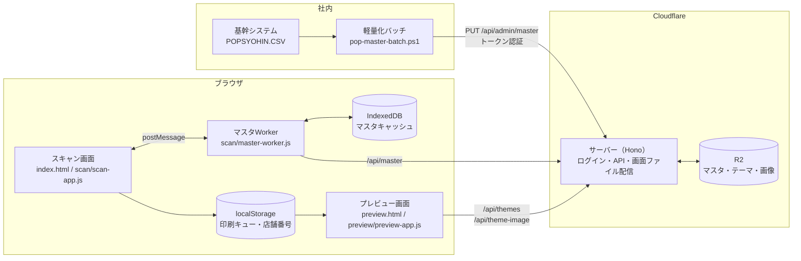
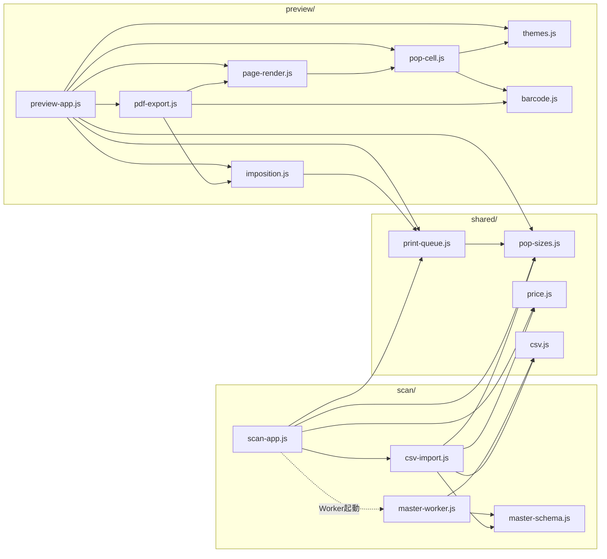

# POP作成システム 技術ドキュメント

Oct 4, 2026 · @tana（第5版：サーバーの Hono 化と独自ログイン、軽量化バッチによるマスタ連携、店舗別価格、商品リスト CSV の読み込みとミックスマッチ表示を反映）

## 文書の構成

| ファイル | 内容 |
| --- | --- |
| [README.md](README.md) | 概要・システム構成・ファイル一覧・依存関係・改訂履歴（この文書） |
| [screens.md](screens.md) | スキャン画面・商品マスタWorker・プレビュー画面と面付け |
| [pop-design.md](pop-design.md) | POP の描画・文字サイズ・バーコード・PDF 出力・CSS 変数 |
| [server.md](server.md) | ログイン・サーバー仕様（Hono）・設定値・手元での開発 |
| [batch.md](batch.md) | 軽量化バッチ（pop-master-batch.ps1） |
| [data-spec.md](data-spec.md) | POP規格・マスタ・商品データ・印刷キュー・商品リスト CSV・テーマの形式 |
| [operations.md](operations.md) | 文字コード・よくある作業・デプロイ・トラブルシューティング・注意点・今後の課題 |

改訂履歴はこの README にまとめて記録します。各ファイルを直したときも、ここに1行追加してください。

## 概要

店頭の値札POPを、JANコードのスキャンから A4 面付けPDFまで一気に作るWebアプリです。商品マスタと POP デザイン（テーマ）は Cloudflare R2 に置き、サーバー（Hono で作った Cloudflare Worker）が API として配信します。画面の HTML・JS・CSS も同じサーバーから配信し、すべての画面と API は全社共通の ID・パスワードによるログインで守っています。

作業の流れは3段階です。

1. スキャン画面（index.html）でヘッダーに店舗番号を入れ、JAN をスキャン、または商品名で検索して印刷待機リストに追加する。商品リスト CSV を読み込んでリストを作ることもできる。マスタの内容に誤りがあれば、リスト上のフォームで修正し、規格ごとの枚数を指定する
2. プレビュー画面（preview.html）で面付けモードとデザインを選び、A4 ページの仕上がりを確認する
3. 「A4-PDFファイルを直接ダウンロード」でブラウザ内で PDF を生成して保存する

商品マスタは、基幹システムが出力する CSV（約220MB・全店舗分）を、社内 PC の PowerShell バッチで数MBに軽量化してからサーバーへ送ります。価格は店舗ごとに違うため、軽量化したマスタは「標準価格」と「標準と違う店舗だけの例外価格」で持ち、画面で入力した店舗番号に応じて切り替えます。

対応する POP 規格は A9タテ・A8ヨコ・A6ハーフ・A6ヨコ・A5ヨコ・A4ヨコ の6種類です。すべての POP の下部に JAN のバーコードと数字を印字します。PDF はすべてブラウザ側で生成するため、サーバー側に印刷処理はありません。

## システム構成

社内の軽量化バッチ、ブラウザ側で動く2画面とマスタWorker（Web Worker）、Cloudflare 側のサーバーと R2 の組み合わせです。2画面の間はサーバーを経由せず、localStorage で印刷リストを受け渡します。

スキャン画面は重い処理（マスタのダウンロード・解析・検索）をすべてマスタWorkerに任せ、postMessage で結果だけを受け取ります。サーバーはマスタ CSV をそのまま返すだけで、**CSV の解析と列名の解決はマスタWorkerの中で完結し、画面には変換済みの「商品データ」だけが渡されます**（形は[data-spec.md](data-spec.md) を参照）。プレビュー画面はマスタを使わず、印刷キュー（修正済み・CSV 読み込みの商品データを含む）と /api/themes のデザインだけで POP を描画します。

サーバーは、実行環境に依存しない本体（app.js）と、Cloudflare 固有の部分（入口 index.js・R2 の部品 storage/r2.js）に分けています。他のサービスに乗り換えるときは、入口とストレージの部品だけを作り直せば済みます。

## ファイル一覧と役割

ブラウザ側の JS はすべて ES モジュールで、画面ごとのフォルダと両画面共通の `shared/` に分かれています。HTML から直接読み込むのは各画面の入口1本だけで、残りは `import` で読み込まれます。

| 配置 | ファイル | 役割 |
| --- | --- | --- |
| / | index.html | スキャン画面。店舗番号・JAN入力欄・商品名検索・CSV 読み込み・印刷待機リスト |
| / | preview.html | A4面付けプレビュー・PDF出力画面 |
| /css/ | app.css | 両画面の画面部品（ヘッダー・店舗番号・入力欄・リスト・修正フォーム・CSV 読み込み結果・ボタン等） |
| /css/ | pop-styles.css | POPセルとA4用紙のスタイル、共通余白、サイズ別の文字・バーコード寸法、ミックスマッチ |
| /js/shared/ | pop-sizes.js | POP規格（6サイズ）・混載グリッド・既定サイズ・初期枚数・ミックスマッチを表示するサイズ |
| /js/shared/ | price.js | 税込価格の計算（税抜 × 税率の切り捨て） |
| /js/shared/ | print-queue.js | 印刷キューの保存・読込・枚数集計 |
| /js/shared/ | csv.js | CSV の解析（マスタWorker と CSV 読み込みで共有） |
| /js/scan/ | scan-app.js | スキャン画面の入口。画面操作・店舗番号・印刷リスト・修正フォーム・CSV 読み込みの画面・マスタWorkerとの通信 |
| /js/scan/ | master-worker.js | マスタの取得・解析・IndexedDBキャッシュ・JAN索引・店舗別価格・商品名検索（モジュールWorker） |
| /js/scan/ | master-schema.js | マスタの列定義と「マスタの行 → 商品データ」の変換。マスタWorker と CSV 読み込みで使う |
| /js/scan/ | csv-import.js | 商品リスト CSV の読み込み・検査・印刷キューの形への変換（DOM 非依存） |
| /js/preview/ | preview-app.js | プレビュー画面の入口。キュー読込・テーマ選択（商品ごとのデザインの解決）・描画・PDFボタン |
| /js/preview/ | themes.js | テーマ一覧の取得・画像URLの決定・配色の適用 |
| /js/preview/ | imposition.js | 面付け計算（DOM非依存）。A4用紙寸法 `PAGE_MM` もここで定義 |
| /js/preview/ | page-render.js | A4ページのDOM生成・A5回転配置（CSSの transform で回転）・空状態の案内。回転配置の目印クラスもここで定義 |
| /js/preview/ | pop-cell.js | POP 1枚分のDOM生成（通常価格・ミックスマッチ）・税抜価格の自動縮小 |
| /js/preview/ | barcode.js | JANバーコード（EAN-13/EAN-8）の符号化と要素生成。目印クラスもここで定義 |
| /js/preview/ | pdf-export.js | html-to-image + jsPDF によるPDF出力、バーコードのベクター描画 |
| サーバー | index.js | Cloudflare 用の入口。R2・画面ファイル配信・設定値の読み方を本体に渡す |
| サーバー | app.js | サーバー本体（Hono）。ログイン確認・各 API・画面ファイル配信。実行環境に依存しない |
| サーバー | auth.js | ログイン（署名付き Cookie）とアップロード用トークンの確認 |
| サーバー | login-page.js | ログイン画面の HTML（CSS も中に書く） |
| サーバー | storage/r2.js | ストレージ部品（R2 版） |
| 社内 PC | pop-master-batch.ps1 | マスタの軽量化とアップロード（PowerShell 5.1） |
| 社内 PC | pop-master-config.psd1 | バッチの設定（入力ファイル・作業フォルダ・送り先 URL など） |

サーバーのファイルは、wrangler.jsonc の `main` に指定したフォルダ（例: `worker/`）に、上の位置関係のまま置きます。画面ファイルのフォルダ（assets）の外に置いてください。

wrangler-account.json（Cloudflare アカウント情報）と cf.json（アクセス元の接続情報）はプログラム本体ではないため、この文書では扱いません。

## 依存関係

依存のルールは2つです。

- 読み込みの向きは「入口 → 各機能 → shared」の一方通行。shared は画面側のファイルを読まない
- スキャン画面（scan/）とプレビュー画面（preview/）は互いを読まず、shared を介してだけつながる

すべて `import` による明示的な依存で、循環はありません。HTML の script タグの読み込み順を気にする必要もありません。

### モジュール依存（矢印は import の向き）

サーバー側は index.js → app.js → auth.js・login-page.js、index.js → storage/r2.js の一方通行です。app.js はストレージ部品を import せず、入口から受け取ります。

定数は「それを決めるファイル」に置き、使う側が import します。A4 用紙寸法 `PAGE_MM` は imposition.js、回転配置の目印クラスは page-render.js、バーコードの目印クラスは barcode.js にあり、pdf-export.js はそれぞれから読み込みます（回転配置は、バーコードの向きを判定するために `ROTATE_INNER_CLASS` だけを使います）。

pdf-export.js は、preview.html が同期読み込みする html-to-image・jsPDF をグローバル変数（`htmlToImage`・`jspdf.jsPDF`）として使います。この2つだけは preview-app.js より前に script タグで読み込む必要があります。

### 外部ライブラリ・サービス

| 名前 | 版 | 読み込み元 | 使う場所 |
| --- | --- | --- | --- |
| Hono | 4 系 | npm（`npm install hono`。デプロイ時に wrangler が1ファイルにまとめる） | サーバー本体（ルーティング・署名付き Cookie） |
| html-to-image | 1.11.11 | cdn.jsdelivr.net | PDF出力（ページの画像化） |
| jsPDF | 2.5.1 | cdnjs.cloudflare.com | PDF出力（A4生成・バーコードのベクター描画） |
| Cloudflare Workers | 無料プラン | — | サーバーの実行環境・画面ファイル配信。1日10万リクエストを超えると課金されずに止まる |
| Cloudflare R2 | — | バインディング `MY_R2_BUCKET` | マスタ・バックアップ・テーマ・画像の保管 |

CSS フレームワークとバーコードライブラリは使っていません。ブラウザ機能としては ES モジュール・モジュールWorker・IndexedDB・localStorage・fetch・TextDecoder（Shift-JIS）・SVG を使います。

## 改訂履歴

| 日付 | 内容 |
| --- | --- |
| 2026-09-27 | 初版 |
| 2026-09-27 | 第2版: 列名の解決をマスタWorkerに一本化（画面は商品データのみ扱う）、マスタ状態を6種類に整理、全JSをESモジュール化・マスタWorkerをモジュールWorker化、枚数欄を POP 規格の定義から自動生成、Tailwind廃止（app.css新設）、PDFファイル名の日付を現地時刻に修正、印刷キューのキーを `pop_print_queue_v2` に変更 |
| 2026-09-27 | 第3版: 印刷待機リストに商品情報の修正フォームを追加（マスタの値に戻す機能付き）、既定サイズを A9タテに変更、全サイズに JAN バーコードを追加（PDFではベクター描画）、医薬品区分が空欄のときの位置ずれを修正、全サイズで最低4mmの余白を確保・税抜価格の自動縮小を追加、JSを shared/・scan/・preview/ のフォルダ構成に整理（印刷キュー処理の一本化、constants.js・data.js・pop-config.js の廃止） |
| 2026-09-27 | 第4版: PDF出力を html2canvas から html-to-image に変更（文字の位置・サイズのずれを解消、回転POPの別撮影を廃止、バーコード除外時の数字のずれを修正）、医薬品リスク区分をバーコードの下（左寄せ）へ移動、コメントが空欄でも行の高さを確保、税抜・税込の「円」の文字サイズを統一、A8ヨコを基準に全サイズの文字サイズを見直し（税込価格の拡大・区切り線まわりの余白追加） |
| 2026-10-04 | 第5版: 軽量化バッチ（PowerShell 5.1）によるマスタ連携と新しいマスタ形式（標準価格＋店舗別の例外価格）、スキャン画面に店舗番号を追加、医薬品区分の「通常商品」を非表示、税込価格の計算を「税抜 × 商品ごとの税率の切り捨て」に変更（修正フォームは税抜→税込の自動計算、`priceExclAuto` 廃止）、サーバーを Hono で作り直し（実行環境に依存しない本体とストレージ部品に分離、CSV の解析をブラウザへ移しエッジキャッシュを廃止）、Cloudflare Access をやめて独自ログインに移行、アップロード API とマスタのバックアップを追加、商品リスト CSV の読み込み・ミックスマッチ表示・商品ごとのデザイン指定を追加 |
| 2026-10-04 | 第5版の文書を7ファイルに分割（README から各ファイルへリンク） |
